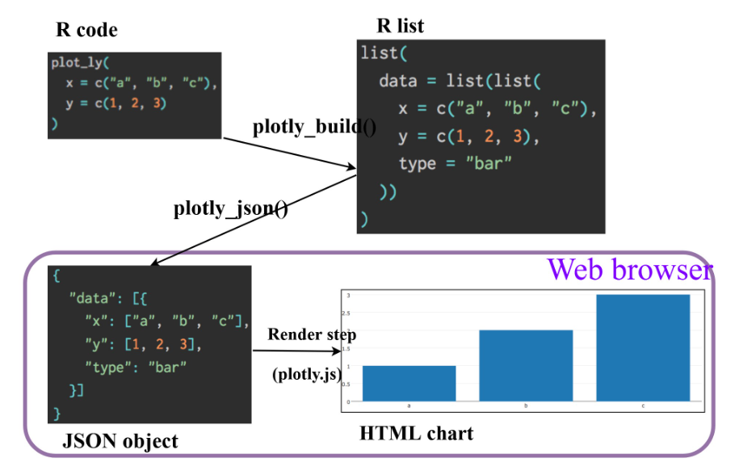
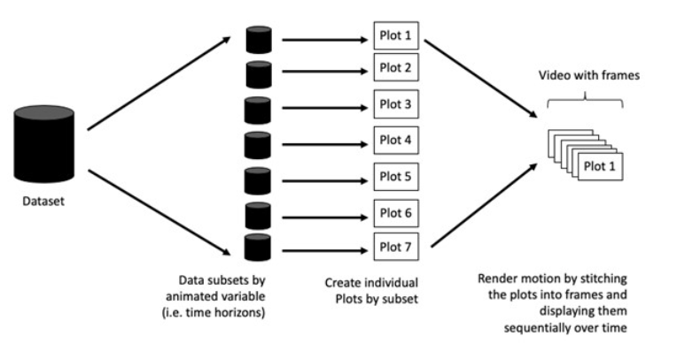

## 3.1 Learning Objectives:

We will learn how to create interactive data visualisation by using functions like ggiraph and poltly packages.

## 3.2 Getting Started:

We need to install and launch the following R packages: - [ggiraph for making ‘ggplot’ graphics interactive.](https://davidgohel.github.io/ggiraph/) - [plotly, R library for plotting interactive statistical graphs.](https://plotly.com/r/) - [DT](https://rstudio.github.io/DT/) provides an R interface to the JavaScript library [DataTables](https://datatables.net/) that create interactive table on html page.() - [tidyverse](https://tidyverse.org/), a family of modern R packages specially designed to support data science, analysis and communication task including creating static statistical graphs. - [patchwork](https://patchwork.data-imaginist.com/) for combining multiple ggplot2 graphs into one figure.

We need to run the code chunk below:

```{r}
pacman::p_load(ggrepel, patchwork, 
               ggthemes, hrbrthemes,
               tidyverse, ggiraph, plotly, 
               patchwork, DT) 
```

## 3.3 Importing Data

We will load the Exam_data.csv and use read_csv of **readr** package to import Exam_data.csv into R.

The code chunk below read_csv() of **readr** package is used to import Exam_data.csv data file into R and save it as an tibble data frame called exam_data.

```{r}
exam_data <- read_csv("data/Exam_data.csv")
```

## 3.4 Interactive Data Visualisation - ggiraph methods

ggiraph is an htmlwidget and a ggplot2 extension. It allows ggplot graphics to be interactive.

It is made with ggplot [geometrics](https://davidgohel.github.io/ggiraph/reference/index.html#section-interactive-geometries) that can understand three arguments:

-   **Tooltip**: a column of data-sets that contain tooltips to be displayed when the mouse is over elements.
-   **Onclick**: a column of data-sets that contain a JavaScript function to be executed when elements are clicked.
-   **Data_id**: a column of data-sets that contain an id to be associated with elements.

### 3.4.1 Tooltip effect with tooltip aesthetic

Below shows a typical code chunk to plot an interactive statistical graph by using **ggiraph** package. Notice that the code chunk consists of two parts. First, an ggplot object will be created. Next, [girafe()](https://davidgohel.github.io/ggiraph/reference/girafe.html) of **ggiraph** will be used to create an interactive svg object.

```{r}
p <- ggplot(data=exam_data, 
       aes(x = MATHS)) +
  geom_dotplot_interactive(
    aes(tooltip = ID),
    stackgroups = TRUE, 
    binwidth = 1, 
    method = "histodot") +
  scale_y_continuous(NULL, 
                     breaks = NULL)
girafe(
  ggobj = p,
  width_svg = 6,
  height_svg = 6*0.618
)
```

There are two steps involved. We first create an interactive version of [ggplot2 geom](https://davidgohel.github.io/ggiraph/reference/geom_dotplot_interactive.html) will be used to create the basic graph. Then [girafe()](https://davidgohel.github.io/ggiraph/reference/girafe.html) will be used to generate an svg object to be displayed on an html page

## 3.5 Interactivity

By hovering the mouse pointer on an data point of interest, the student's ID will be displayed.

### 3.5.1 Displaying multiple information on tooltip

The content of the tooltip can be customised by including a list object as shown in the code chunk below.

```{r}
exam_data$tooltip <- c(paste0(     
  "Name = ", exam_data$ID,         
  "\n Class = ", exam_data$CLASS)) 

p <- ggplot(data=exam_data, 
       aes(x = MATHS)) +
  geom_dotplot_interactive(
    aes(tooltip = exam_data$tooltip), 
    stackgroups = TRUE,
    binwidth = 1,
    method = "histodot") +
  scale_y_continuous(NULL,               
                     breaks = NULL)
girafe(
  ggobj = p,
  width_svg = 8,
  height_svg = 8*0.618
)
```

The first three lines of codes in the code chunk create a new field called tooltip. At the same time, it populates text in ID and CLASS fields into the newly created field. Next, this newly created field is used as tooltip field as shown in the code of line 7.

## 3.6 Interactivity

By hovering the mouse pointer on an data point of interest, the student's ID will be displayed.

### 3.6.1 Customising Tooltip style

Code chunk below uses [opts_tooltip()](https://davidgohel.github.io/ggiraph/reference/opts_tooltip.html) of **ggiraph** to customize tooltip rendering by add css declarations.

```{r}
tooltip_css <- "background-color:white; #<<
font-style:bold; color:black;" #<<

p <- ggplot(data=exam_data, 
       aes(x = MATHS)) +
  geom_dotplot_interactive(              
    aes(tooltip = ID),                   
    stackgroups = TRUE,                  
    binwidth = 1,                        
    method = "histodot") +               
  scale_y_continuous(NULL,               
                     breaks = NULL)
girafe(                                  
  ggobj = p,                             
  width_svg = 6,                         
  height_svg = 6*0.618,
  options = list(    #<<
    opts_tooltip(    #<<
      css = tooltip_css)) #<<
)       
```

Refer to [Customizing girafe objects](https://www.ardata.fr/ggiraph-book/customize.html) to learn more about how to customise ggiraph objects.

### 3.6.2 Displaying statistics on tooltip

Code chunk below shows an advanced way to customise tooltip. In this example, a function is used to compute 90% confident interval of the mean. The derived statistics are then displayed in the tooltip.

```{r}
tooltip <- function(y, ymax, accuracy = .01) {
  mean <- scales::number(y, accuracy = accuracy)
  sem <- scales::number(ymax - y, accuracy = accuracy)
  paste("Mean maths scores:", mean, "+/-", sem)
}

gg_point <- ggplot(data=exam_data, 
                   aes(x = RACE),
) +
  stat_summary(aes(y = MATHS, 
                   tooltip = after_stat(  
                     tooltip(y, ymax))),  
    fun.data = "mean_se", 
    geom = GeomInteractiveCol,  
    fill = "light blue"
  ) +
  stat_summary(aes(y = MATHS),
    fun.data = mean_se,
    geom = "errorbar", width = 0.2, size = 0.2
  )

girafe(ggobj = gg_point,
       width_svg = 8,
       height_svg = 8*0.618)
```

### 3.6.3 Hover effect with data_id aesthetic

Code chunk below shows the second interactive feature of ggiraph, namely **data_id**.

```{r}
p <- ggplot(data=exam_data, 
       aes(x = MATHS)) +
  geom_dotplot_interactive(           
    aes(data_id = CLASS),             
    stackgroups = TRUE,               
    binwidth = 1,                        
    method = "histodot") +               
  scale_y_continuous(NULL,               
                     breaks = NULL)
girafe(                                  
  ggobj = p,                             
  width_svg = 6,                         
  height_svg = 6*0.618                      
)                                        
```

### 3.6.4 Styling hover effect

Code chunk below, css codes are used to change the highlighting effect.

```{r}
p <- ggplot(data=exam_data, 
       aes(x = MATHS)) +
  geom_dotplot_interactive(              
    aes(data_id = CLASS),              
    stackgroups = TRUE,                  
    binwidth = 1,                        
    method = "histodot") +               
  scale_y_continuous(NULL,               
                     breaks = NULL)
girafe(                                  
  ggobj = p,                             
  width_svg = 6,                         
  height_svg = 6*0.618,
  options = list(                        
    opts_hover(css = "fill: #202020;"),  
    opts_hover_inv(css = "opacity:0.2;") 
  )                                        
)                                        
```

### 3.6.5 Combining tooltip and hover effect

We are combining tooltip and hover effect on the interactive statistical graph as shown below

```{r}
p <- ggplot(data=exam_data, 
       aes(x = MATHS)) +
  geom_dotplot_interactive(              
    aes(tooltip = CLASS, 
        data_id = CLASS),              
    stackgroups = TRUE,                  
    binwidth = 1,                        
    method = "histodot") +               
  scale_y_continuous(NULL,               
                     breaks = NULL)
girafe(                                  
  ggobj = p,                             
  width_svg = 6,                         
  height_svg = 6*0.618,
  options = list(                        
    opts_hover(css = "fill: #202020;"),  
    opts_hover_inv(css = "opacity:0.2;") 
  )                                        
)                                        
```

### 3.6.6 Click effect with onclick

Onclick is used within the Shiny web framework to trigger actions when a user clicks on a specific UI element.Below is an example of it

```{r}
exam_data$onclick <- sprintf("window.open(\"%s%s\")",
"https://www.moe.gov.sg/schoolfinder?journey=Primary%20school",
as.character(exam_data$ID))

p <- ggplot(data=exam_data, 
       aes(x = MATHS)) +
  geom_dotplot_interactive(              
    aes(onclick = onclick),              
    stackgroups = TRUE,                  
    binwidth = 1,                        
    method = "histodot") +               
  scale_y_continuous(NULL,               
                     breaks = NULL)
girafe(                                  
  ggobj = p,                             
  width_svg = 6,                         
  height_svg = 6*0.618)                                        
```

::: callout-warning
## Warning

Note that click actions must be a string column in the dataset containing valid javascript instructions.
:::

### 3.6.7 Coordinated Multiple Views with ggiraph

Coordinated multiple views methods has been implemented in data visualisation below.

When a data point of one of the dotplot is selected, the corresponding data point ID on the second data visualisation will be highlighted too

In order to build a coordinated multiple views as shown in the example above, the following programming strategy will be used:

-   <div>

    1.  Appropriate interactive functions of **ggiraph** will be used to create the multiple views.

    </div>

-   <div>

    2.  patchwork function of patchwork package will be used inside girafe function to create the interactive coordinated multiple views.

    </div>

```{r}
p1 <- ggplot(data=exam_data, 
       aes(x = MATHS)) +
  geom_dotplot_interactive(              
    aes(data_id = ID),              
    stackgroups = TRUE,                  
    binwidth = 1,                        
    method = "histodot") +  
  coord_cartesian(xlim=c(0,100)) + 
  scale_y_continuous(NULL,               
                     breaks = NULL)

p2 <- ggplot(data=exam_data, 
       aes(x = ENGLISH)) +
  geom_dotplot_interactive(              
    aes(data_id = ID),              
    stackgroups = TRUE,                  
    binwidth = 1,                        
    method = "histodot") + 
  coord_cartesian(xlim=c(0,100)) + 
  scale_y_continuous(NULL,               
                     breaks = NULL)

girafe(code = print(p1 + p2), 
       width_svg = 6,
       height_svg = 3,
       options = list(
         opts_hover(css = "fill: #202020;"),
         opts_hover_inv(css = "opacity:0.2;")
         )
       ) 
```

## 3.7 Interactive Data Visualisation - plotly methods!

Plotly’s R graphing library create interactive web graphics from **ggplot2** graphs and/or a custom interface to the (MIT-licensed) JavaScript library [plotly.js](https://plotly.com/javascript/) inspired by the grammar of graphics. Different from other plotly platform, plot.R is free and open source.



There are two ways to create interactive graph by using plotly, they are:

-   by using plot_ly(), and
-   by using ggplotly()

### 3.7.1 Creating an interactive scatter plot: plot_ly() method

The tabset below shows an example a basic interactive plot created by using plot_ly()

::: panel-tabset
## The plot

```{r}
#| echo: false

plot_ly(data = exam_data,
        x = ~MATHS,
        y = ~ENGLISH)
```

## The code chunk

```{r}
plot_ly(data = exam_data,
        x = ~MATHS,
        y = ~ENGLISH)
```
:::

### 3.7.2 Working with visual variable: plot_ly() method

In the code chunk below, color argument is mapped to a qualitative visual variable (i.e. RACE).

::: panel-tabset
## The plot

```{r}
#| echo: false

plot_ly(data = exam_data, 
        x = ~ENGLISH, 
        y = ~MATHS, 
        color = ~RACE)
```

## The code chunk

```{r}
plot_ly(data = exam_data, 
        x = ~ENGLISH, 
        y = ~MATHS, 
        color = ~RACE)
```
:::

### 3.7.3 Creating an interactive scatter plot: ggplotly() method

The code chunk below plots an interactive scatter plot by using ggplotly().

::: panel-tabset
## The plot

```{r}
#| echo: false

plot_ly(data = exam_data, 
        x = ~ENGLISH, 
        y = ~MATHS, 
        color = ~RACE)
```

## The code chunk

```{r}
plot_ly(data = exam_data, 
        x = ~ENGLISH, 
        y = ~MATHS, 
        color = ~RACE)
```
:::

### 3.7.4 Coordinated Multiple Views with plotly

It involves three steps:

-   [highlight_key()](https://www.rdocumentation.org/packages/plotly/versions/4.9.2/topics/highlight_key) of **plotly** package is used as shared data.
-   two scatterplots will be created by using ggplot2 functions.
-   lastly, [subplot()](https://plotly.com/r/subplots/) of **plotly** package is used to place them next to each other side-by-side.

::: panel-tabset
## The plot

```{r}
#| echo: false

d <- highlight_key(exam_data)
p1 <- ggplot(data=d, 
            aes(x = MATHS,
                y = ENGLISH)) +
  geom_point(size=1) +
  coord_cartesian(xlim=c(0,100),
                  ylim=c(0,100))

p2 <- ggplot(data=d, 
            aes(x = MATHS,
                y = SCIENCE)) +
  geom_point(size=1) +
  coord_cartesian(xlim=c(0,100),
                  ylim=c(0,100))
subplot(ggplotly(p1),
        ggplotly(p2))
```

## The code chunk

```{r}
d <- highlight_key(exam_data)
p1 <- ggplot(data=d, 
            aes(x = MATHS,
                y = ENGLISH)) +
  geom_point(size=1) +
  coord_cartesian(xlim=c(0,100),
                  ylim=c(0,100))

p2 <- ggplot(data=d, 
            aes(x = MATHS,
                y = SCIENCE)) +
  geom_point(size=1) +
  coord_cartesian(xlim=c(0,100),
                  ylim=c(0,100))
subplot(ggplotly(p1),
        ggplotly(p2))
```
:::

## 3.8 Interactive Data Visualisation - crosstalk methods!

[Crosstalk](https://rstudio.github.io/crosstalk/index.html) is an add-on to the htmlwidgets package. It extends htmlwidgets with a set of classes, functions, and conventions for implementing cross-widget interactions (currently, linked brushing and filtering).

### 3.8.1 Interactive Data Table: DT package

-   A wrapper of the JavaScript Library [DataTables](https://datatables.net/)
-   Data objects in R can be rendered as HTML tables using the JavaScript library ‘DataTables’ (typically via R Markdown or Shiny).

```{r}
DT::datatable(exam_data, class= "compact")
```

### 3.8.2 Linked brushing: crosstalk method

::: panel-tabset
## The plot

```{r}
#| echo: false

d <- highlight_key(exam_data) 
p <- ggplot(d, 
            aes(ENGLISH, 
                MATHS)) + 
  geom_point(size=1) +
  coord_cartesian(xlim=c(0,100),
                  ylim=c(0,100))

gg <- highlight(ggplotly(p),        
                "plotly_selected")  

crosstalk::bscols(gg,               
                  DT::datatable(d), 
                  widths = 5)        
```

## The code chunk

```{r}
d <- highlight_key(exam_data) 
p <- ggplot(d, 
            aes(ENGLISH, 
                MATHS)) + 
  geom_point(size=1) +
  coord_cartesian(xlim=c(0,100),
                  ylim=c(0,100))

gg <- highlight(ggplotly(p),        
                "plotly_selected")  

crosstalk::bscols(gg,               
                  DT::datatable(d), 
                  widths = 5)        
```

Things to learn from the code chunk:

-   **highlight()** is a function from the **plotly** package. It sets a variety of options for brushing (i.e., highlighting) multiple plots. These options are primarily designed for linking multiple plotly graphs and may not behave as expected when linking plotly to another htmlwidget package via **crosstalk**. In some cases, other htmlwidgets will respect these options, such as persistent selection in **leaflet**.

-   **bscols()** is a helper function from the **crosstalk** package. It makes it easy to place HTML elements side by side. It can be called directly from the console but is especially designed to work in an R Markdown or Quarto document. **Warning:** This will bring in all of Bootstrap!
:::


# Additional Analysis

## 3.9.1 Additional Analysis 1 - Subject Peformance Comparison
**Objective**
To compare the distribution of scores across Mathematics, English, and Science.

```{r}
exam_long <- exam_data %>%
  pivot_longer(cols = c(MATHS, ENGLISH, SCIENCE),
               names_to = "Subject",
               values_to = "Score")

ggplot(exam_long,
       aes(x = Subject,
           y = Score,
           fill = Subject)) +
  geom_boxplot() +
  theme_ipsum() +
  labs(
    title = "Comparison of Score Distribution Across Subjects",
    x = "Subject",
    y = "Score"
  )
```

**Insights**
The boxplot reveals median score differences, variation in performance, and outliers between genders, helping identify whether one gender tends to perform better or shows more score variability.

## 3.9.2 Additional Analysis 2 - Class Performance Comparison
**Objective**
To compare English score distributions across different classes.

```{r}
ggplot(exam_data,
       aes(x = CLASS,
           y = ENGLISH,
           fill = CLASS)) +
  geom_boxplot() +
  theme_ipsum() +
  labs(
    title = "English Score Distribution by Class",
    x = "Class",
    y = "English Score"
  )
```
**Insights**
The boxplot highlights differences in median scores, variability within classes, and extreme performers, helping identify which classes perform better or show greater score spread.

## 3.9.3 Additional Analysis 3 - Correlation Analysis Between Subjects
**Objective**
To examine the strength and direction of relationships between Mathematics, English, and Science scores.

```{r}
corr_matrix <- exam_data %>%
  select(MATHS, ENGLISH, SCIENCE) %>%
  cor()

corrplot(corr_matrix,
         method = "color",
         type = "upper",
         addCoef.col = "black")
```

**Insights**
The heatmap highlights how strongly the subjects are related to each other. A higher correlation value indicates that students who perform well in one subject tend to perform well in another. Hence, we can identify the strongest subject relationship across subjects.

## 3.9.4 Additional Analysis 4 - Student Peformance Ranking
**Objective**
To rank students based on their average scores across Mathematics, English, and Science in order to understand the overall performance hierarchy among students.

```{r}
exam_rank <- exam_data %>%
  mutate(avg_score = (MATHS + ENGLISH + SCIENCE) / 3) %>%
  arrange(desc(avg_score)) %>%
  mutate(rank = row_number())

ggplot(exam_rank,
       aes(x = rank,
           y = avg_score)) +
  geom_line(color = "steelblue") +
  geom_point(color = "steelblue", size = 2) +
  labs(
    title = "Student Performance Ranking Based on Average Scores",
    x = "Student Rank",
    y = "Average Score"
  ) +
  theme_ipsum()
```

**Insights**
The ranking plot highlights the distribution of student performance levels across the dataset. Students at the top of the ranking represent the highest academic performers, while those at the bottom indicate lower overall performance.

## 3.9.5 Subject Performance Gap Analysis
**Objective**
To analyse the difference between Mathematics and English scores in order to identify students who perform significantly better in one subject than the other.

```{r}
exam_data %>%
  mutate(score_gap = MATHS - ENGLISH) %>%
  ggplot(aes(x = score_gap)) +
  geom_histogram(bins = 20,
                 fill = "orange",
                 color = "grey25") +
  labs(
    title = "Performance Gap Between Maths and English",
    x = "Score Difference (Maths - English)",
    y = "Number of Students"
  ) +
  theme_ipsum()
```

**Insights**
This analysis helps reveal subject imbalance in student performance and identifies whether most students perform consistently across subjects.

## 3.10 Reference

### 3.10.1 ggiraph

This link provides online version of the reference guide and several useful articles. Use this link to download the pdf version of the reference guide.

-   [How to Plot With Ggiraph](https://www.r-bloggers.com/2018/04/how-to-plot-with-ggiraph/)
-   [Interactive map of France with ggiraph](https://rstudio-pubs-static.s3.amazonaws.com/152833_56a4917734204de7b37881d164cf8051.html)
-   [Custom interactive sunbursts with ggplot in R](https://www.pipinghotdata.com/posts/2021-06-01-custom-interactive-sunbursts-with-ggplot-in-r/)
-   This [link](https://github.com/d-qn/2016_08_02_rioOlympicsAthletes)\] provides code example on how ggiraph is used to interactive graphs for [Swiss Olympians - the solo specialists.](https://www.swissinfo.ch/eng/rio-2016-_swiss-olympiansthe-solo-specialists-/42349156?utm_content=bufferd148b&utm_medium=social&utm_source=twitter.com&utm_campaign=buffer)

# 4 Programming Animated Statisical Graphics with R

## 4.1 Overview

Animated visualisations attract audience attention and create a stronger impression than static graphics. In this exercise, you will learn to create animated data visualisations using gganimate and plotly. You will also learn to reshape data with tidyr and process or transform data using dplyr.

### 4.1.1. Basic concepts of animation

Animation in plots works by generating multiple individual frames, not by moving the plot itself. Each frame represents a different subset of the data. When these frames are stitched together sequentially, they create the illusion of motion, similar to a flipbook or cartoon.



### 4.1.2 Terminology

It’s important to understand some of the key concepts and terminology related to this type of visualization.

-   1.**Frame:** In an animated line graph, each frame represents a different point in time or a different category. When the frame changes, the data points on the graph are updated to reflect the new data.

-   2.**Animation Attributes:** The animation attributes are the settings that control how the animation behaves. For example, you can specify the duration of each frame, the easing function used to transition between frames, and whether to start the animation from the current frame or from the beginning.

::: callout-tip
## Tip

Before you start making animated graphs, you should first ask yourself: Does it make sense to go through the effort? If you are conducting an exploratory data analysis, an animated graphic may not be worth the time investment. However, if you are giving a presentation, a few well-placed animated graphics can help an audience connect with your topic remarkably better than static counterparts.
:::

## 4.2 Getting Started

### 4.2.1 Loading the R packages

First, write a code chunk to check, install and load the following R packages:

-   [**plotly**](https://plotly.com/r/), R library for plotting interactive statistical graphs.
-   [**gganimate**](https://gganimate.com/), an ggplot extension for creating animated statistical graphs.
-   [**gifski**](https://cran.r-project.org/web/packages/gifski/index.html) converts video frames to GIF animations using pngquant’s fancy features for efficient cross-frame palettes and temporal dithering. It produces animated GIFs that use thousands of colors per frame.
-   [**gapminder**](https://cran.r-project.org/web/packages/gapminder/index.html): An excerpt of the data available at Gapminder.org. We just want to use its country_colors scheme.
-   [**tidyverse**](https://tidyverse.org/), a family of modern R packages specially designed to support data science, analysis and communication task including creating static statistical graphs.

```{r}
pacman::p_load(readxl, gifski, gapminder,
               plotly, gganimate, tidyverse)
```

### 4.2.2 Importing the data

The Data worksheet from GlobalPopulation Excel workbook will be used.

Write a code chunk to import Data worksheet from GlobalPopulation Excel workbook by using appropriate R package from tidyverse family.

```{r}
#Step 1:
col <- c("Country", "Continent")

#Step 2:
globalPop <- read_xls("data/GlobalPopulation.xls",
                         sheet="Data") %>%
  mutate(across(col, as.factor)) %>%
  mutate(Year = as.integer(Year))
```

::: callout-note
## Things to learn from the code chunk above

- `read_xls()` of **readxl** package is used to import the Excel worksheet.
- `mutate_each_()` of **dplyr** package is used to convert all character data type into factor.
- `mutate()` of **dplyr** package is used to convert data values of **Year** field into integer.
:::

Unfortunately, `mutate_each_()` was deprecated in **dplyr 0.7.0**, and `funs()` was deprecated in **dplyr 0.8.0**. In view of this, we will rewrite the code using `mutate_at()` as shown in the code chunk below.

```{r}
col <- c("Country", "Continent")
globalPop <- read_xls("data/GlobalPopulation.xls",
                      sheet="Data") %>%
  mutate_at(col, as.factor) %>%
  mutate(Year = as.integer(Year))
```

Instead of using `mutate_at()`, [across()](https://dplyr.tidyverse.org/reference/across.html) can be used to derive the same outputs.

```{r}
col <- c("Country", "Continent")
globalPop <- read_xls("data/GlobalPopulation.xls",
                      sheet="Data") %>%
  mutate(across(col, as.factor)) %>%
  mutate(Year = as.integer(Year))
```

## 4.3 Animated Data Visualisation: gganimate methods

**gganimate** extends the grammar of graphics as implemented by ggplot2 to include the description of animation. It does this by providing a range of new grammar classes that can be added to the plot object in order to customise how it should change with time.

- `transition_*()` defines how the data should be spread out and how it relates to itself across time.
- `view_*()` defines how the positional scales should change along the animation.
- `shadow_*()` defines how data from other points in time should be presented in the given point in time.
- `enter_*()/exit_*()` defines how new data should appear and how old data should disappear during the course of the animation.
- `ease_aes()` defines how different aesthetics should be eased during transitions.

### 4.3.1 Building a static population bubble plot

In the code chunk below, the basic ggplot2 functions are used to create a static bubble plot.

```{r}
ggplot(globalPop, aes(x = Old, y = Young, 
                      size = Population, 
                      colour = Country)) +
  geom_point(alpha = 0.7, 
             show.legend = FALSE) +
  scale_colour_manual(values = country_colors) +
  scale_size(range = c(2, 12)) +
  labs(title = 'Year: {frame_time}', 
       x = '% Aged', 
       y = '% Young') 
```

### 4.3.2 Building the animated bubble plot

In the code chunk below,

- [transition_time()](https://gganimate.com/reference/transition_time.html) of **gganimate** is used to create transition through distinct states in time (i.e. Year).
- `ease_aes()` is used to control easing of aesthetics. The default is linear. Other methods are: quadratic, cubic, quartic, quintic, sine, circular, exponential, elastic, back, and bounce.

```{r}
ggplot(globalPop, aes(x = Old, y = Young, 
                      size = Population, 
                      colour = Country)) +
  geom_point(alpha = 0.7, 
             show.legend = FALSE) +
  scale_colour_manual(values = country_colors) +
  scale_size(range = c(2, 12)) +
  labs(title = 'Year: {frame_time}', 
       x = '% Aged', 
       y = '% Young') +
  transition_time(Year) +       
  ease_aes('linear')          
```

The animated bubble chart

## 4.4 Animated Data Visualisation: plotly

In **Plotly R** package, both `ggplotly()` and `plot_ly()` support key frame animations through the `frame` argument/aesthetic. They also support an `ids` argument/aesthetic to ensure smooth transitions between objects with the same id (which helps facilitate object constancy).

### 4.4.1 Building an animated bubble plot: ggplotly() method

We will create an animated bubble plot by using `ggplot()` method.

::: panel-tabset
## The plot

```{r}
#| echo: false

gg <- ggplot(globalPop, 
       aes(x = Old, 
           y = Young, 
           size = Population, 
           colour = Country)) +
  geom_point(aes(size = Population,
                 frame = Year),
             alpha = 0.7, 
             show.legend = FALSE) +
  scale_colour_manual(values = country_colors) +
  scale_size(range = c(2, 12)) +
  labs(x = '% Aged', 
       y = '% Young')

ggplotly(gg)     
```

## The code chunk

```{r}
gg <- ggplot(globalPop, 
       aes(x = Old, 
           y = Young, 
           size = Population, 
           colour = Country)) +
  geom_point(aes(size = Population,
                 frame = Year),
             alpha = 0.7, 
             show.legend = FALSE) +
  scale_colour_manual(values = country_colors) +
  scale_size(range = c(2, 12)) +
  labs(x = '% Aged', 
       y = '% Young')

ggplotly(gg)      
```
:::

::: callout-note
## Things to learn from the code chunk above

- Appropriate ggplot2 functions are used to create a static bubble plot. The output is then saved as an R object called gg.
- `ggplotly()` is then used to convert the R graphic object into an animated svg object.
:::

`show.legend = FALSE` argument was used, the legend still appears on the plot. To overcome this problem, `theme(legend.position='none')` should be used as shown in the plot and code chunk below.

::: panel-tabset
## The plot

```{r}
#| echo: false

gg <- ggplot(globalPop, 
       aes(x = Old, 
           y = Young, 
           size = Population, 
           colour = Country)) +
  geom_point(aes(size = Population,
                 frame = Year),
             alpha = 0.7) +
  scale_colour_manual(values = country_colors) +
  scale_size(range = c(2, 12)) +
  labs(x = '% Aged', 
       y = '% Young') + 
  theme(legend.position='none')

ggplotly(gg)   
```

## The code chunk

```{r}
gg <- ggplot(globalPop, 
       aes(x = Old, 
           y = Young, 
           size = Population, 
           colour = Country)) +
  geom_point(aes(size = Population,
                 frame = Year),
             alpha = 0.7) +
  scale_colour_manual(values = country_colors) +
  scale_size(range = c(2, 12)) +
  labs(x = '% Aged', 
       y = '% Young') + 
  theme(legend.position='none')

ggplotly(gg)     
```
:::

### 4.4.2 Building an animated bubble plot: `plot_ly()` method

We will create an animated bubble plot by using `plot_ly()` method.

::: panel-tabset
## The plot

```{r}
#| echo: false

bp <- globalPop %>%
  plot_ly(x = ~Old, 
          y = ~Young, 
          size = ~Population, 
          color = ~Continent,
          sizes = c(2, 100),
          frame = ~Year, 
          text = ~Country, 
          hoverinfo = "text",
          type = 'scatter',
          mode = 'markers'
          ) %>%
  layout(showlegend = FALSE)
bp  
```

## The code chunk

```{r}
bp <- globalPop %>%
  plot_ly(x = ~Old, 
          y = ~Young, 
          size = ~Population, 
          color = ~Continent,
          sizes = c(2, 100),
          frame = ~Year, 
          text = ~Country, 
          hoverinfo = "text",
          type = 'scatter',
          mode = 'markers'
          ) %>%
  layout(showlegend = FALSE)
bp    
```
:::

## 4.5 Reference

- Visit this [**link**](https://rpubs.com/raymondteo/dataviz8) for a very interesting implementation of gganimate by your senior.
- [Building an animation step-by-step with gganimate](https://www.alexcookson.com/post/2020-10-18-building-an-animation-step-by-step-with-gganimate/)
- [Creating a composite gif with multiple gganimate panels](https://solarchemist.se/2021/08/02/composite-gif-gganimate/)