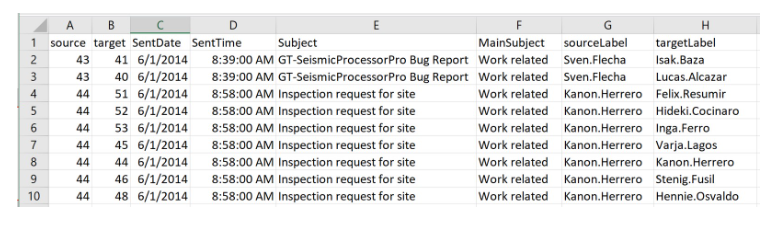
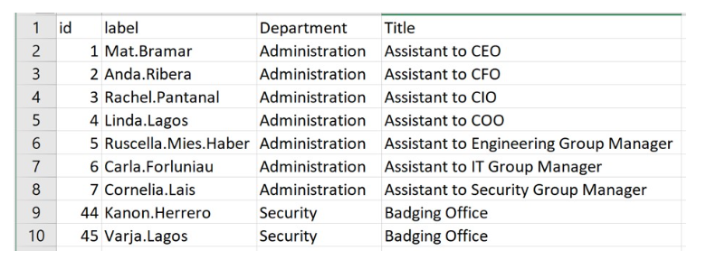
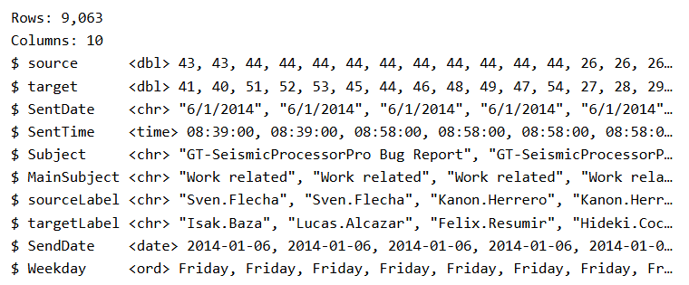
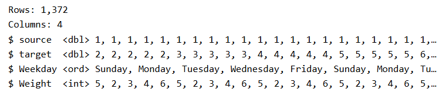
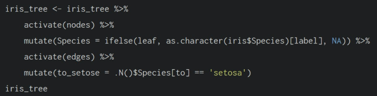
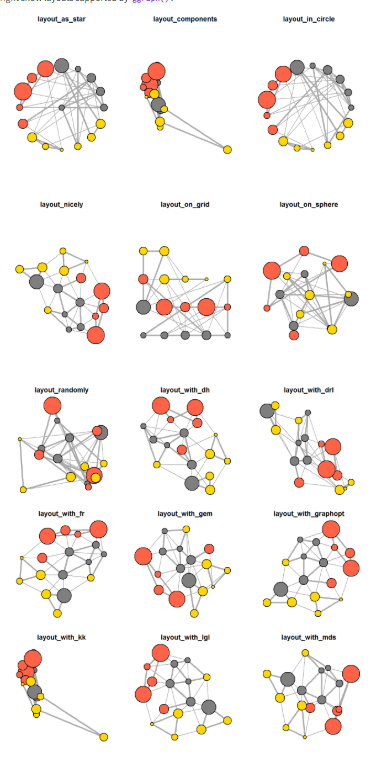
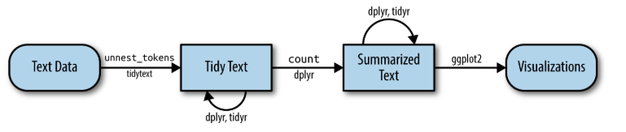
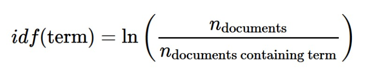
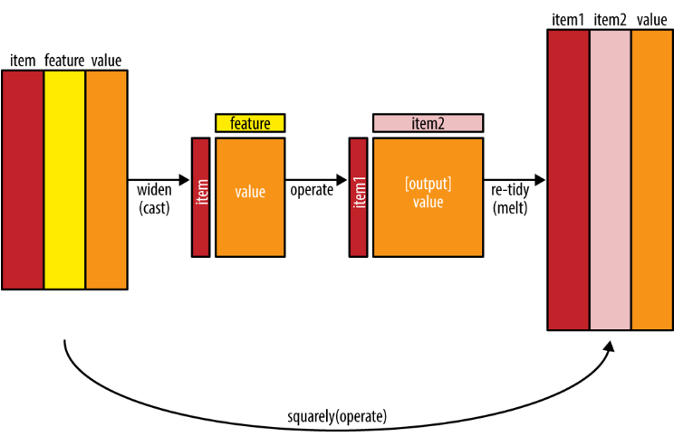

## 27.1 **Overview**

In this hands-on exercise, you will learn how to model, analyse and visualise network data using R.

By the end of this hands-on exercise, you will be able to:

-   create graph object data frames, manipulate them using appropriate functions of *dplyr*, *lubridate*, and *tidygraph*,

-   build network graph visualisation using appropriate functions of *ggraph*,

-   compute network geometrics using *tidygraph*,

-   build advanced graph visualisation by incorporating the network geometrics, and

-   build interactive network visualisation using *visNetwork* package.

## **27.2 Getting Started**

### **27.2.1 Installing and launching R packages**

In this hands-on exercise, four network data modelling and visualisation packages will be installed and launched. They are igraph, tidygraph, ggraph and visNetwork. Beside these four packages, tidyverse and [lubridate](https://lubridate.tidyverse.org/), an R package specially designed to handle and wrangling time data will be installed and launched too.

The code chunk:

```{r}
pacman::p_load(igraph, tidygraph, ggraph, 
               visNetwork, lubridate, clock,
               tidyverse, graphlayouts, 
               concaveman, ggforce)
```

## **27.3 The Data**

The data sets used in this hands-on exercise is from an oil exploration and extraction company. There are two data sets. One contains the nodes data and the other contains the edges (also know as link) data.

### **27.3.1 The edges data**

-   *GAStech-email_edges.csv* which consists of two weeks of 9063 emails correspondances between 55 employees.



### **27.3.2 The nodes data**

-   *GAStech_email_nodes.csv* which consist of the names, department and title of the 55 employees.



### **27.3.3 Importing network data from files**

In this step, you will import GAStech_email_node.csv and GAStech_email_edges-v2.csv into RStudio environment by using `read_csv()` of **readr** package.

```{r}
GAStech_nodes <- read_csv("GAStech_email_node.csv")
GAStech_edges <- read_csv("GAStech_email_edge-v2.csv")
```

### **27.3.4 Reviewing the imported data**

Next, we will examine the structure of the data frame using *glimpse()* of **dplyr**.

```{r}
glimpse(GAStech_edges)
```

::: callout-note
Warning

The output report of GAStech_edges above reveals that the *SentDate* is treated as “Character” data type instead of *date* data type. This is an error! Before we continue, it is important for us to change the data type of *SentDate* field back to “Date”” data type.
:::

### **27.3.5 Wrangling time**

The code chunk below will be used to perform the changes.

```{r}
GAStech_edges <- GAStech_edges %>%
  mutate(SendDate = dmy(SentDate)) %>%
  mutate(Weekday = wday(SentDate,
                        label = TRUE,
                        abbr = FALSE))
```

::: callout-note
Things to learn from the code chunk above:

-   both *dmy()* and *wday()* are functions of **lubridate** package. [lubridate](https://r4va.netlify.app/cran.r-project.org/web/packages/lubridate/vignettes/lubridate.html) is an R package that makes it easier to work with dates and times.

-   *dmy()* transforms the SentDate to Date data type.

-   *wday()* returns the day of the week as a decimal number or an ordered factor if label is TRUE. The argument abbr is FALSE keep the daya spells in full, i.e. Monday. The function will create a new column in the data.frame i.e. Weekday and the output of *wday()* will save in this newly created field.

-   the values in the *Weekday* field are in ordinal scale.
:::

### **27.3.6 Reviewing the revised date fields**

Table below shows the data structure of the reformatted *GAStech_edges* data frame



### **27.3.7 Wrangling attributes**

A close examination of *GAStech_edges* data.frame reveals that it consists of individual e-mail flow records. This is not very useful for visualisation.

In view of this, we will aggregate the individual by date, senders, receivers, main subject and day of the week.

The code chunk:

```{r}
GAStech_edges_aggregated <- GAStech_edges %>%
  filter(MainSubject == "Work related") %>%
  group_by(source, target, Weekday) %>%
    summarise(Weight = n()) %>%
  filter(source!=target) %>%
  filter(Weight > 1) %>%
  ungroup()
```

::: callout-note
Things to learn from the code chunk above:

-   four functions from **dplyr** package are used. They are: *filter()*, *group()*, *summarise()*, and *ungroup()*.

-   The output data.frame is called **GAStech_edges_aggregated**.

-   A new field called *Weight* has been added in GAStech_edges_aggregated.
:::

### **27.3.8 Reviewing the revised edges file**

Table below shows the data structure of the reformatted *GAStech_edges* data frame



## **27.4 Creating network objects using tidygraph**

In this section, you will learn how to create a graph data model by using **tidygraph** package. It provides a tidy API for graph/network manipulation. While network data itself is not tidy, it can be envisioned as two tidy tables, one for node data and one for edge data. tidygraph provides a way to switch between the two tables and provides dplyr verbs for manipulating them. Furthermore it provides access to a lot of graph algorithms with return values that facilitate their use in a tidy workflow.

Before getting started, you are advised to read these two articles:

-   [Introducing tidygraph](https://www.data-imaginist.com/2017/introducing-tidygraph/)

-   [tidygraph 1.1 - A tidy hope](https://www.data-imaginist.com/2018/tidygraph-1-1-a-tidy-hope/)

### **27.4.1 The tbl_graph object**

Two functions of **tidygraph** package can be used to create network objects, they are:

-   [`tbl_graph()`](https://tidygraph.data-imaginist.com/reference/tbl_graph.html) creates a **tbl_graph** network object from nodes and edges data.

-   [`as_tbl_graph()`](https://tidygraph.data-imaginist.com/reference/tbl_graph.html) converts network data and objects to a **tbl_graph** network. Below are network data and objects supported by `as_tbl_graph()`

    -   a node data.frame and an edge data.frame,

    -   data.frame, list, matrix from base,

    -   igraph from igraph,

    -   network from network,

    -   dendrogram and hclust from stats,

    -   Node from data.tree,

    -   phylo and evonet from ape, and

    -   graphNEL, graphAM, graphBAM from graph (in Bioconductor).

### **27.4.2 The dplyr verbs in tidygraph**

-   *activate()* verb from **tidygraph** serves as a switch between tibbles for nodes and edges. All dplyr verbs applied to **tbl_graph** object are applied to the active tibble.



-   In the above the *.N()* function is used to gain access to the node data while manipulating the edge data. Similarly *.E()* will give you the edge data and *.G()* will give you the **tbl_graph** object itself.

### **27.4.3 Using `tbl_graph()` to build tidygraph data model.**

In this section, you will use `tbl_graph()` of **tinygraph** package to build an tidygraph’s network graph data.frame.

Before typing the codes, you are recommended to review to reference guide of [`tbl_gr`](https://tidygraph.data-imaginist.com/reference/tbl_graph.html)

```{r}
GAStech_graph <- tbl_graph(nodes = GAStech_nodes,
                           edges = GAStech_edges_aggregated, 
                           directed = TRUE)
```

### **27.4.4 Reviewing the output tidygraph’s graph object**

```{r}
GAStech_graph
```

### **27.4.5 Reviewing the output tidygraph’s graph object**

-   The output above reveals that *GAStech_graph* is a tbl_graph object with 54 nodes and 4541 edges.

-   The command also prints the first six rows of “Node Data” and the first three of “Edge Data”.

-   It states that the Node Data is **active**. The notion of an active tibble within a tbl_graph object makes it possible to manipulate the data in one tibble at a time.

### **27.4.6 Changing the active object**

The nodes tibble data frame is activated by default, but you can change which tibble data frame is active with the *activate()* function. Thus, if we wanted to rearrange the rows in the edges tibble to list those with the highest “weight” first, we could use *activate()* and then *arrange()*.

For example,

```{r}
GAStech_graph %>%
  activate(edges) %>%
  arrange(desc(Weight))
```

Visit the reference guide of [*activate()*](https://tidygraph.data-imaginist.com/reference/activate.html) to find out more about the function.

## **27.5 Plotting Static Network Graphs with ggraph package**

[**ggraph**](https://ggraph.data-imaginist.com/) is an extension of **ggplot2**, making it easier to carry over basic ggplot skills to the design of network graphs.

As in all network graph, there are three main aspects to a **ggraph**’s network graph, they are:

-   [nodes](https://cran.r-project.org/web/packages/ggraph/vignettes/Nodes.html),

-   [edges](https://cran.r-project.org/web/packages/ggraph/vignettes/Edges.html) and

-   [layouts](https://cran.r-project.org/web/packages/ggraph/vignettes/Layouts.html).

For a comprehensive discussion of each of this aspect of graph, please refer to their respective vignettes provided.

### **27.5.1 Plotting a basic network graph**

The code chunk below uses [*ggraph()*](https://ggraph.data-imaginist.com/reference/ggraph.html), [*geom-edge_link()*](https://ggraph.data-imaginist.com/reference/geom_edge_link.html) and [*geom_node_point()*](https://ggraph.data-imaginist.com/reference/geom_node_point.html) to plot a network graph by using *GAStech_graph*. Before your get started, it is advisable to read their respective reference guide at least once.

```{r}
ggraph(GAStech_graph) +
  geom_edge_link() +
  geom_node_point()
```

::: callout-note
Things to learn from the code chunk above:

-   The basic plotting function is `ggraph()`, which takes the data to be used for the graph and the type of layout desired. Both of the arguments for `ggraph()` are built around *igraph*. Therefore, `ggraph()` can use either an *igraph* object or a *tbl_graph* object.
:::

### **27.5.2 Changing the default network graph theme**

In this section, you will use [*theme_graph()*](https://ggraph.data-imaginist.com/reference/theme_graph.html) to remove the x and y axes. Before your get started, it is advisable to read it’s reference guide at least once.

```{r}
g <- ggraph(GAStech_graph) + 
  geom_edge_link(aes()) +
  geom_node_point(aes())

g + theme_graph()
```

::: callout-note
Things to learn from the code chunk above:

-   **ggraph** introduces a special ggplot theme that provides better defaults for network graphs than the normal ggplot defaults. `theme_graph()`, besides removing axes, grids, and border, changes the font to Arial Narrow (this can be overridden).

-   The ggraph theme can be set for a series of plots with the `set_graph_style()` command run before the graphs are plotted or by using `theme_graph()` in the individual plots.
:::

### **27.5.3 Changing the coloring of the plot**

Furthermore, `theme_graph()` makes it easy to change the coloring of the plot.

```{r}
g <- ggraph(GAStech_graph) + 
  geom_edge_link(aes(colour = 'grey50')) +
  geom_node_point(aes(colour = 'grey40'))

g + theme_graph(background = 'grey10',
                text_colour = 'white')
```

### **27.5.4 Working with ggraph’s layouts**

**ggraph** support many layout for standard used, they are: star, circle, nicely (default), dh, gem, graphopt, grid, mds, spahere, randomly, fr, kk, drl and lgl. Figures below and on the right show layouts supported by `ggraph()`.



### **27.5.5 Fruchterman and Reingold layout**

The code chunks below will be used to plot the network graph using Fruchterman and Reingold layout.

```{r}
g <- ggraph(GAStech_graph, 
            layout = "fr") +
  geom_edge_link(aes()) +
  geom_node_point(aes())

g + theme_graph()
```

Thing to learn from the code chunk above:

-   *layout* argument is used to define the layout to be used.

### **27.5.6 Modifying network nodes**

In this section, you will colour each node by referring to their respective departments.

```{r}
g <- ggraph(GAStech_graph, 
            layout = "nicely") + 
  geom_edge_link(aes()) +
  geom_node_point(aes(colour = Department, 
                      size = 3))

g + theme_graph()
```

Things to learn from the code chunks above:

-   *geom_node_point* is equivalent in functionality to *geo_point* of **ggplot2**. It allows for simple plotting of nodes in different shapes, colours and sizes. In the codes chnuks above colour and size are used.

### **27.5.7 Modifying edges**

In the code chunk below, the thickness of the edges will be mapped with the *Weight* variable.

```{r}
g <- ggraph(GAStech_graph, 
            layout = "nicely") +
  geom_edge_link(aes(width=Weight), 
                 alpha=0.2) +
  scale_edge_width(range = c(0.1, 5)) +
  geom_node_point(aes(colour = Department), 
                  size = 3)

g + theme_graph()
```

Things to learn from the code chunks above:

-   *geom_edge_link* draws edges in the simplest way - as straight lines between the start and end nodes. But, it can do more that that. In the example above, argument *width* is used to map the width of the line in proportional to the Weight attribute and argument alpha is used to introduce opacity on the line.

## **27.6 Creating facet graphs**

Another very useful feature of **ggraph** is faceting. In visualising network data, this technique can be used to reduce edge over-plotting in a very meaning way by spreading nodes and edges out based on their attributes. In this section, you will learn how to use faceting technique to visualise network data.

There are three functions in ggraph to implement faceting, they are:

-   [*facet_nodes()*](https://ggraph.data-imaginist.com/reference/facet_nodes.html) whereby edges are only draw in a panel if both terminal nodes are present here,

-   [*facet_edges()*](https://ggraph.data-imaginist.com/reference/facet_edges.html) whereby nodes are always drawn in al panels even if the node data contains an attribute named the same as the one used for the edge facetting, and

-   [*facet_graph()*](https://ggraph.data-imaginist.com/reference/facet_graph.html) faceting on two variables simultaneously.

### **27.6.1 Working with *facet_edges()***

In the code chunk below, [*facet_edges()*](https://ggraph.data-imaginist.com/reference/facet_edges.html) is used. Before getting started, it is advisable for you to read it’s reference guide at least once.

```{r}
set_graph_style()

g <- ggraph(GAStech_graph, 
            layout = "nicely") + 
  geom_edge_link(aes(width=Weight), 
                 alpha=0.2) +
  scale_edge_width(range = c(0.1, 5)) +
  geom_node_point(aes(colour = Department), 
                  size = 2)

g + facet_edges(~Weekday)
```

### **27.6.2 Working with *facet_edges()***

The code chunk below uses *theme()* to change the position of the legend.

```{r}
set_graph_style()

g <- ggraph(GAStech_graph, 
            layout = "nicely") + 
  geom_edge_link(aes(width=Weight), 
                 alpha=0.2) +
  scale_edge_width(range = c(0.1, 5)) +
  geom_node_point(aes(colour = Department), 
                  size = 2) +
  theme(legend.position = 'bottom')
  
g + facet_edges(~Weekday)
```

### **27.6.3 A framed facet graph**

The code chunk below adds frame to each graph.

```{r}
set_graph_style() 

g <- ggraph(GAStech_graph, 
            layout = "nicely") + 
  geom_edge_link(aes(width=Weight), 
                 alpha=0.2) +
  scale_edge_width(range = c(0.1, 5)) +
  geom_node_point(aes(colour = Department), 
                  size = 2)
  
g + facet_edges(~Weekday) +
  th_foreground(foreground = "grey80",  
                border = TRUE) +
  theme(legend.position = 'bottom')
```

### **27.6.4 Working with *facet_nodes()***

In the code chunkc below, [*facet_nodes()*](https://ggraph.data-imaginist.com/reference/facet_nodes.html) is used. Before getting started, it is advisable for you to read it’s reference guide at least once.

```{r}
set_graph_style()

g <- ggraph(GAStech_graph, 
            layout = "nicely") + 
  geom_edge_link(aes(width=Weight), 
                 alpha=0.2) +
  scale_edge_width(range = c(0.1, 5)) +
  geom_node_point(aes(colour = Department), 
                  size = 2)
  
g + facet_nodes(~Department)+
  th_foreground(foreground = "grey80",  
                border = TRUE) +
  theme(legend.position = 'bottom')
```

## **27.7 Network Metrics Analysis**

### **27.7.1 Computing centrality indices**

Centrality measures are a collection of statistical indices use to describe the relative important of the actors are to a network. There are four well-known centrality measures, namely: degree, betweenness, closeness and eigenvector. It is beyond the scope of this hands-on exercise to cover the principles and mathematics of these measure here. Students are encouraged to refer to *Chapter 7: Actor Prominence* of **A User’s Guide to Network Analysis in R** to gain better understanding of theses network measures.

```{r}
g <- GAStech_graph %>%
  mutate(betweenness_centrality = centrality_betweenness()) %>%
  ggraph(layout = "fr") + 
  geom_edge_link(aes(width=Weight), 
                 alpha=0.2) +
  scale_edge_width(range = c(0.1, 5)) +
  geom_node_point(aes(colour = Department,
            size=betweenness_centrality))
g + theme_graph()
```

Things to learn from the code chunk above:

-   *mutate()* of **dplyr** is used to perform the computation.

-   the algorithm used, on the other hand, is the *centrality_betweenness()* of **tidygraph**.

### **27.7.2 Visualising network metrics**

It is important to note that from **ggraph v2.0** onward tidygraph algorithms such as centrality measures can be accessed directly in ggraph calls. This means that it is no longer necessary to precompute and store derived node and edge centrality measures on the graph in order to use them in a plot.

```{r}
g <- GAStech_graph %>%
  ggraph(layout = "fr") + 
  geom_edge_link(aes(width=Weight), 
                 alpha=0.2) +
  scale_edge_width(range = c(0.1, 5)) +
  geom_node_point(aes(colour = Department, 
                      size = centrality_betweenness()))
g + theme_graph()
```

### **27.7.3 Visualising Community**

tidygraph package inherits many of the community detection algorithms imbedded into igraph and makes them available to us, including *Edge-betweenness (group_edge_betweenness)*, *Leading eigenvector (group_leading_eigen)*, *Fast-greedy (group_fast_greedy)*, *Louvain (group_louvain)*, *Walktrap (group_walktrap)*, *Label propagation (group_label_prop)*, *InfoMAP (group_infomap)*, *Spinglass (group_spinglass)*, and *Optimal (group_optimal)*. Some community algorithms are designed to take into account direction or weight, while others ignore it. Use this [link](https://tidygraph.data-imaginist.com/reference/group_graph.html) to find out more about community detection functions provided by tidygraph,

In the code chunk below *group_edge_betweenness()* is used.

```{r}
g <- GAStech_graph %>%
  mutate(community = as.factor(
    group_edge_betweenness(
      weights = Weight, 
      directed = TRUE))) %>%
  ggraph(layout = "fr") + 
  geom_edge_link(
    aes(
      width=Weight), 
    alpha=0.2) +
  scale_edge_width(
    range = c(0.1, 5)) +
  geom_node_point(
    aes(colour = community))  

g + theme_graph()
```

In order to support effective visual investigation, the community network above has been revised by using [`geom_mark_hull()`](https://ggforce.data-imaginist.com/reference/geom_mark_hull.html) of [ggforce](https://ggforce.data-imaginist.com/) package.

::: callout-note
Important

Please be reminded that you must to install and include [**ggforce**](https://ggforce.data-imaginist.com/) and [**concaveman**](https://www.rdocumentation.org/packages/concaveman/versions/1.1.0/topics/concaveman) packages before running the code chunk below.
:::

```{r}
g <- GAStech_graph %>%
  activate(nodes) %>%
  mutate(community = as.factor(
    group_optimal(weights = Weight)),
         betweenness_measure = centrality_betweenness()) %>%
  ggraph(layout = "fr") +
  geom_mark_hull(
    aes(x, y, 
        group = community, 
        fill = community),  
    alpha = 0.2,  
    expand = unit(0.3, "cm"),  # Expand
    radius = unit(0.3, "cm")  # Smoothness
  ) + 
  geom_edge_link(aes(width=Weight), 
                 alpha=0.2) +
  scale_edge_width(range = c(0.1, 5)) +
  geom_node_point(aes(fill = Department,
                      size = betweenness_measure),
                      color = "black",
                      shape = 21)
  
g + theme_graph()
```

## **27.8 Building Interactive Network Graph with visNetwork**

-   [visNetwork()](http://datastorm-open.github.io/visNetwork/) is a R package for network visualization, using [vis.js](http://visjs.org/) javascript library.

-   *visNetwork()* function uses a nodes list and edges list to create an interactive graph.

    -   The nodes list must include an “id” column, and the edge list must have “from” and “to” columns.

    -   The function also plots the labels for the nodes, using the names of the actors from the “label” column in the node list.

-   The resulting graph is fun to play around with.

    -   You can move the nodes and the graph will use an algorithm to keep the nodes properly spaced.

    -   You can also zoom in and out on the plot and move it around to re-center it.

### **27.8.1 Data preparation**

Before we can plot the interactive network graph, we need to prepare the data model by using the code chunk below.

```{r}
GAStech_edges_aggregated <- GAStech_edges %>%
  left_join(GAStech_nodes, by = c("sourceLabel" = "label")) %>%
  rename(from = id) %>%
  left_join(GAStech_nodes, by = c("targetLabel" = "label")) %>%
  rename(to = id) %>%
  filter(MainSubject == "Work related") %>%
  group_by(from, to) %>%
    summarise(weight = n()) %>%
  filter(from!=to) %>%
  filter(weight > 1) %>%
  ungroup()
```

### **27.8.2 Plotting the first interactive network graph**

The code chunk below will be used to plot an interactive network graph by using the data prepared.

```{r}
visNetwork(GAStech_nodes, 
           GAStech_edges_aggregated)
```

### **27.8.3 Working with layout**

In the code chunk below, Fruchterman and Reingold layout is used.

```{r}
visNetwork(GAStech_nodes,
           GAStech_edges_aggregated) %>%
  visIgraphLayout(layout = "layout_with_fr") 
```

Visit [Igraph](http://datastorm-open.github.io/visNetwork/igraph.html) to find out more about *visIgraphLayout*’s argument.

### **27.8.4 Working with visual attributes - Nodes**

visNetwork() looks for a field called “group” in the nodes object and colour the nodes according to the values of the group field.

The code chunk below rename Department field to group.

```{r}
GAStech_nodes <- GAStech_nodes %>%
  rename(group = Department) 
```

When we rerun the code chunk below, visNetwork shades the nodes by assigning unique colour to each category in the group field.

```{r}
visNetwork(GAStech_nodes,
           GAStech_edges_aggregated) %>%
  visIgraphLayout(layout = "layout_with_fr") %>%
  visLegend() %>%
  visLayout(randomSeed = 123)
```

### **27.8.5 Working with visual attributes - Edges**

In the code run below *visEdges()* is used to symbolise the edges. - The argument *arrows* is used to define where to place the arrow. - The *smooth* argument is used to plot the edges using a smooth curve.

```{r}
visNetwork(GAStech_nodes,
           GAStech_edges_aggregated) %>%
  visIgraphLayout(layout = "layout_with_fr") %>%
  visEdges(arrows = "to", 
           smooth = list(enabled = TRUE, 
                         type = "curvedCW")) %>%
  visLegend() %>%
  visLayout(randomSeed = 123)
```

Visit [Option](http://datastorm-open.github.io/visNetwork/edges.html) to find out more about visEdges’s argument.

### **27.8.6 Interactivity**

In the code chunk below, *visOptions()* is used to incorporate interactivity features in the data visualisation.

-   The argument *highlightNearest* highlights nearest when clicking a node.

-   The argument *nodesIdSelection* adds an id node selection creating an HTML select element.

```{r}
visNetwork(GAStech_nodes,
           GAStech_edges_aggregated) %>%
  visIgraphLayout(layout = "layout_with_fr") %>%
  visOptions(highlightNearest = TRUE,
             nodesIdSelection = TRUE) %>%
  visLegend() %>%
  visLayout(randomSeed = 123)
```

Visit [Option](http://datastorm-open.github.io/visNetwork/options.html) to find out more about visOption’s argument.

## **27.9 Reference**

[26  R for Data Science: Tidyverse principles and methods](https://r4va.netlify.app/chap26)

[28  R for Data Science: Tidyverse principles and methods](https://r4va.netlify.app/chap28)

# Additional Analysis

## Additional Analysis 1 - Insurance Fraud Ring Detection Network

**Objective:** To identify suspicious claim relationship clusters by analysing repeated interactions between policyholders, workshops, and claim agents.

```{r}
set.seed(123)

fraud_nodes <- tibble(
  id = 1:45,
  label = paste0("Actor_", 1:45),
  Type = rep(c("Policyholder", "Workshop", "Claim Agent"), length.out = 45)
)

fraud_edges <- bind_rows(
  expand_grid(source = 1:12, target = 1:12),
  expand_grid(source = 13:27, target = 13:27),
  expand_grid(source = 28:45, target = 28:45),
  tibble(
    source = sample(c(5, 18, 32), 80, replace = TRUE),
    target = sample(1:45, 80, replace = TRUE)
  )
) %>%
  filter(source != target) %>%
  mutate(
    Weight = sample(1:8, n(), replace = TRUE)
  ) %>%
  group_by(source, target) %>%
  summarise(Weight = sum(Weight), .groups = "drop") %>%
  filter(Weight >= 3)

fraud_graph <- tbl_graph(
  nodes = fraud_nodes,
  edges = fraud_edges,
  directed = FALSE
)

fraud_graph %>%
  activate(nodes) %>%
  mutate(
    degree_score = centrality_degree(),
    community = as.factor(group_louvain())
  ) %>%
  ggraph(layout = "fr") +
  geom_edge_link(
    aes(width = Weight),
    alpha = 0.25,
    colour = "grey40"
  ) +
  scale_edge_width(range = c(0.2, 3)) +
  geom_node_point(
    aes(colour = community,
        size = degree_score)
  ) +
  theme_graph() +
  labs(title = "Insurance Fraud Ring Detection Network")
```

**Insight:** This analysis highlights suspicious claim relationship groups. Nodes with larger sizes represent actors with more connections, while the colours represent possible communities within the fraud network. Dense clusters may suggest groups of policyholders, workshops, and claim agents that interact repeatedly, which could be useful for further fraud investigation.

## Additional Analysis 2 - Non-Work Email Communication Network

**Objective:** To examine informal or non-work-related communication patterns among GAStech employees.

```{r}
nonwork_nodes <- GAStech_nodes %>%
  mutate(NodeGroup = ifelse("Department" %in% names(.), Department, group))

nonwork_edges <- GAStech_edges %>%
  filter(MainSubject != "Work related") %>%
  group_by(source, target) %>%
  summarise(Weight = n(), .groups = "drop") %>%
  filter(source != target) %>%
  filter(Weight > 1)

nonwork_graph <- tbl_graph(
  nodes = nonwork_nodes,
  edges = nonwork_edges,
  directed = TRUE
)

nonwork_graph %>%
  activate(nodes) %>%
  mutate(
    degree_score = centrality_degree()
  ) %>%
  ggraph(layout = "fr") +
  geom_edge_link(
    aes(width = Weight),
    alpha = 0.25,
    colour = "grey50"
  ) +
  scale_edge_width(range = c(0.2, 2.5)) +
  geom_node_point(
    aes(colour = NodeGroup,
        size = degree_score)
  ) +
  theme_graph() +
  labs(title = "Non-Work Email Communication Network")
```

**Insight:** This analysis focuses on non-work-related email interactions within GAStech. Larger nodes represent employees with more informal communication connections, while node colours show their departments. This helps reveal whether informal communication is concentrated within departments or spread across different departments.

## 29.1 **Learning Outcome**

In this hands-on exercise, you will learn how to visualise and analyse text data using R.

By the end of this hands-on exercise, you will be able to:

-   understand tidytext framework for processing, analysing and visualising text data,
-   write function for importing multiple files into R,
-   combine multiple files into a single data frame,
-   clean and wrangle text data by using tidyverse approach,
-   visualise words with Word Cloud,
-   compute term frequency–inverse document frequency (TF-IDF) using tidytext method, and
-   visualising texts and terms relationship.

## 29.2 **Getting Started**

## 29.2.1 **Installing and launching R packages**

n this hands-on exercise, the following R packages for handling, processing, wrangling, analysing and visualising text data will be used:

-   tidytext, tidyverse (mainly readr, purrr, stringr, ggplot2)
-   widyr,
-   wordcloud and ggwordcloud,
-   textplot (required igraph, tidygraph and ggraph, )
-   DT,
-   lubridate and hms.

The code chunk:

```{r}
pacman::p_load(tidytext, widyr, wordcloud, DT, ggwordcloud, textplot, lubridate, hms,
tidyverse, tidygraph, ggraph, igraph)
```

## 29.3 **Importing Multiple Text Files from Multiple Folders**

### 29.3.1 **Creating a folder list**

```{r}
news20 <- "chap29/data/20news/"
```

### 29.3.2 **Define a function to read all files from a folder into a dataframe**

```{r}
read_folder <- function(infolder) {
  tibble(file = dir(infolder, 
                    full.names = TRUE)) %>%
    mutate(text = map(file, 
                      read_lines)) %>%
    transmute(id = basename(file), 
              text) %>%
    unnest(text)
}
```

## 29.4 **Importing Multiple Text Files from Multiple Folders**

### **29.4.1 Reading in all the messages from the 20news folder**

```{r}
# Define the folder path
news20 <- "20news"

# Check that the 20news folder exists
stopifnot(dir.exists(news20))

# Create output folder for RDS file if it does not exist
dir.create("data/rds", recursive = TRUE, showWarnings = FALSE)

raw_text <- tibble(
  folder = dir(news20, full.names = TRUE)
) %>%
  filter(file.info(folder)$isdir) %>%
  mutate(folder_out = map(folder, read_folder)) %>%
  unnest(cols = c(folder_out)) %>%
  transmute(
    newsgroup = basename(folder),
    id = id,
    text = text
  )

write_rds(raw_text, "data/rds/news20.rds")
```

::: callout-note
Things to learn from the code chunk above:

-   [`read_lines()`](https://readr.tidyverse.org/reference/read_lines.html) of [**readr**](https://readr.tidyverse.org/) package is used to read up to n_max lines from a file.

-   [`map()`](https://purrr.tidyverse.org/reference/map.html) of [**purrr**](https://purrr.tidyverse.org/) package is used to transform their input by applying a function to each element of a list and returning an object of the same length as the input.

-   [`unnest()`](https://tidyr.tidyverse.org/reference/nest.html) of **dplyr** package is used to flatten a list-column of data frames back out into regular columns.

-   [`mutate()`](https://dplyr.tidyverse.org/reference/mutate.html) of **dplyr** is used to add new variables and preserves existing ones;

-   [`transmute()`](https://dplyr.tidyverse.org/reference/mutate.html) of **dplyr** is used to add new variables and drops existing ones.

-   [`read_rds()`](https://readr.tidyverse.org/reference/read_rds.html) is used to save the extracted and combined data frame as rds file for future use.
:::

## 29.5 **Initial EDA**

Figure below shows the frequency of messages by newsgroup.

The code chunk:

```{r}
raw_text <- read_rds("data/rds/news20.rds")

raw_text %>%
  group_by(newsgroup) %>%
  summarize(messages = n_distinct(id), .groups = "drop") %>%
  ggplot(aes(messages, newsgroup)) +
  geom_col(fill = "lightblue") +
  labs(y = NULL)
```

## 29.6 **Introducing tidytext**

-   Using tidy data principles in processing, analysing and visualising text data.

-   Much of the infrastructure needed for text mining with tidy data frames already exists in packages like ‘dplyr’, ‘broom’, ‘tidyr’, and ‘ggplot2’.

Figure below shows the workflow using tidytext approach for processing and visualising text data.



### 29.6.1 **Removing header and automated email signitures**

Notice that each message has some structure and extra text that we don’t want to include in our analysis. For example, every message has a header, containing field such as “from:” or “in_reply_to:” that describe the message. Some also have automated email signatures, which occur after a line like “–”.

```{r}
cleaned_text <- raw_text %>%
  group_by(newsgroup, id) %>%
  filter(cumsum(text == "") > 0,
         cumsum(str_detect(
           text, "^--")) == 0) %>%
  ungroup()
```

::: callout-note
Things to learn from the code chunk:

-   [`cumsum()`](https://rdrr.io/r/base/cumsum.html) of base R is used to return a vector whose elements are the cumulative sums of the elements of the argument.

-   [`str_detect()`](https://stringr.tidyverse.org/reference/str_detect.html) from **stringr** is used to detect the presence or absence of a pattern in a string.
:::

### **29.6.2 Removing lines with nested text representing quotes from other users.**

In this code chunk below, regular expressions are used to remove with nested text representing quotes from other users.

```{r}
cleaned_text <- cleaned_text %>%
  filter(str_detect(text, "^[^>]+[A-Za-z\\d]")
         | text == "",
         !str_detect(text, 
                     "writes(:|\\.\\.\\.)$"),
         !str_detect(text, 
                     "^In article <")
  )
```

::: callout-note
Things to learn from the code chunk:

-   [`str_detect()`](https://stringr.tidyverse.org/reference/str_detect.html) from **stringr** is used to detect the presence or absence of a pattern in a string.

-   [`filter()`](https://dplyr.tidyverse.org/reference/filter.html) of **dplyr** package is used to subset a data frame, retaining all rows that satisfy the specified conditions.
:::

### 29.6.3 **Text Data Processing**

In this code chunk below, [`unnest_tokens()`](https://www.rdocumentation.org/packages/tidytext/versions/0.3.1/topics/unnest_tokens) of **tidytext** package is used to split the dataset into tokens, while [`stop_words()`](https://rdrr.io/cran/tidytext/man/stop_words.html) is used to remove stop-words.

```{r}
usenet_words <- cleaned_text %>%
  unnest_tokens(word, text) %>%
  filter(str_detect(word, "[a-z']$"),
         !word %in% stop_words$word)
```

Now that we’ve removed the headers, signatures, and formatting, we can start exploring common words. For starters, we could find the most common words in the entire dataset, or within particular newsgroups.

```{r}
usenet_words %>%
  count(word, sort = TRUE)
```

Instead of counting individual word, you can also count words within by newsgroup by using the code chunk below.

```{r}
words_by_newsgroup <- usenet_words %>%
  count(newsgroup, word, sort = TRUE) %>%
  ungroup()
```

### 29.6.4 **Visualising Words in newsgroups**

In this code chunk below, `wordcloud()` of **wordcloud** package is used to plot a static wordcloud.

```{r}
wordcloud(words_by_newsgroup$word,
          words_by_newsgroup$n,
          max.words = 300)
```

### 29.6.5 **Visualising Words in newsgroups**

The wordcloud below is plotted by using [**ggwordcloud**](https://lepennec.github.io/ggwordcloud/) package.

The code chunk used:

```{r}
set.seed(1234)

words_by_newsgroup %>%
  group_by(newsgroup) %>%
  slice_max(n, n = 30, with_ties = FALSE) %>%
  ungroup() %>%
  ggplot(aes(label = word, size = n)) +
  geom_text_wordcloud() +
  theme_minimal() +
  facet_wrap(~newsgroup)
```

## 29.7 **Basic Concept of TF-IDF**

-   [tf–idf](https://en.wikipedia.org/wiki/Tf%E2%80%93idf), short for term frequency–inverse document frequency, is a numerical statistic that is intended to reflect how important a word is to a document in a collection of [corpus](https://en.wikipedia.org/wiki/Text_corpus).



### **29.7.1 Computing tf-idf within newsgroups**

The code chunk below uses *bind_tf_idf()* of tidytext to compute and bind the term frequency, inverse document frequency and ti-idf of a tidy text dataset to the dataset.

```{r}
tf_idf <- words_by_newsgroup %>%
  bind_tf_idf(word, newsgroup, n) %>%
  arrange(desc(tf_idf))
```

### **29.7.2 Visualising tf-idf as interactive table**

Table below is an interactive table created by using `datatable()`.

### **29.7.3 Visualising tf-idf as interactive table**

The code chunk below uses `datatable()` of DT package to create a html table that allows pagination of rows and columns.

```{r}
DT::datatable(tf_idf, filter = 'top') %>% 
  formatRound(columns = c('tf', 'idf', 
                          'tf_idf'), 
              digits = 3) %>%
  formatStyle(0, 
              target = 'row', 
              lineHeight='25%')
```

::: callout-note
Things to learn from the code chunk:

-   `filter()` argument is used to turn control the filter UI.

-   `formatRound()` is used to customise the values format. The argument *digits* define the number of decimal places.

-   `formatStyle()` is used to customise the output table. In this example, the arguments *target* and *lineHeight* are used to reduce the line height by 25%.
:::

To learn more about customising DT’s table, visit this [link](https://rstudio.github.io/DT/functions.html).

### **29.7.4 Visualising tf-idf within newsgroups**

Facet bar charts technique is used to visualise the tf-idf values of science related newsgroup.

The code chunk used to prepare the plot.

```{r}
tf_idf %>%
  filter(str_detect(newsgroup, "^sci\\.")) %>%
  group_by(newsgroup) %>%
  slice_max(tf_idf, 
            n = 12) %>%
  ungroup() %>%
  mutate(word = reorder(word, 
                        tf_idf)) %>%
  ggplot(aes(tf_idf, 
             word, 
             fill = newsgroup)) +
  geom_col(show.legend = FALSE) +
  facet_wrap(~ newsgroup, 
             scales = "free") +
  labs(x = "tf-idf", 
       y = NULL)
```

### **29.7.5 Counting and correlating pairs of words with the widyr package**

-   To count the number of times that two words appear within the same document, or to see how correlated they are.

-   Most operations for finding pairwise counts or correlations need to turn the data into a wide matrix first.

-   [**widyr**](https://cran.r-project.org/web/packages/widyr/index.html) package first ‘casts’ a tidy dataset into a wide matrix, performs an operation such as a correlation on it, then re-tidies the result.

In this code chunk below, `pairwise_cor()` of **widyr** package is used to compute the correlation between newsgroup based on the common words found.

```{r}
newsgroup_cors <- words_by_newsgroup %>%
  pairwise_cor(newsgroup, 
               word, 
               n, 
               sort = TRUE)
```

### **29.7.6 Visualising correlation as a network**

Now, we can visualise the relationship between newgroups in network graph as shown below.

The code chunk:

```{r}
set.seed(2017)

newsgroup_cors %>%
  filter(correlation > .025) %>%
  graph_from_data_frame() %>%
  ggraph(layout = "fr") +
  geom_edge_link(aes(alpha = correlation, 
                     width = correlation)) +
  geom_node_point(size = 6, 
                  color = "lightblue") +
  geom_node_text(aes(label = name),
                 color = "red",
                 repel = TRUE) +
  theme_void()
```

### **29.7.7 Bigram**

In this code chunk below, a bigram data frame is created by using `unnest_tokens()` of tidytext.

```{r}
bigrams <- cleaned_text %>%
  unnest_tokens(bigram, 
                text, 
                token = "ngrams", 
                n = 2)
```

```{r}
bigrams
```

### **29.7.8 Counting bigrams**

The code chunk is used to count and sort the bigram data frame ascendingly.

```{r}
bigrams_count <- bigrams %>%
  filter(bigram != 'NA') %>%
  count(bigram, sort = TRUE)
```

```{r}
bigrams_count
```

### **29.7.9 Cleaning bigram**

The code chunk below is used to seperate the bigram into two words.

```{r}
bigrams_separated <- bigrams %>%
  filter(bigram != 'NA') %>%
  separate(bigram, c("word1", "word2"), 
           sep = " ")

bigrams_filtered <- bigrams_separated %>%
  filter(!word1 %in% stop_words$word) %>%
  filter(!word2 %in% stop_words$word)
```

```{r}
bigrams_filtered
```

### **29.7.10 Counting the bigram again**

```{r}
bigram_counts <- bigrams_filtered %>% 
  count(word1, word2, sort = TRUE)
```

### **29.7.11 Create a network graph from bigram data frame**

In the code chunk below, a network graph is created by using `graph_from_data_frame()` of **igraph** package.

```{r}
bigram_graph <- bigram_counts %>%
  filter(n > 3) %>%
  graph_from_data_frame()
bigram_graph
```

### **29.7.12 Visualizing a network of bigrams with ggraph**

In this code chunk below, **ggraph** package is used to plot the bigram.

The code chunk used to plot the network graph:

```{r}
set.seed(1234)

ggraph(bigram_graph, layout = "fr") +
  geom_edge_link() +
  geom_node_point() +
  geom_node_text(aes(label = name), 
                 vjust = 1, 
                 hjust = 1)
```

### **29.7.13 Revised version**

The code chunl used to plot the network graph.

```{r}
set.seed(1234)

a <- grid::arrow(type = "closed", 
                 length = unit(.15,
                               "inches"))

ggraph(bigram_graph, 
       layout = "fr") +
  geom_edge_link(aes(edge_alpha = n), 
                 show.legend = FALSE,
                 arrow = a, 
                 end_cap = circle(.07,
                                  'inches')) +
  geom_node_point(color = "lightblue", 
                  size = 5) +
  geom_node_text(aes(label = name), 
                 vjust = 1, 
                 hjust = 1) +
  theme_void()
```

## **29.8 References**

#### 29.8.0.1 widyr

-   Reference guide

    -   [widyr: Widen, process, and re-tidy a dataset](https://cran.r-project.org/web/packages/widyr/vignettes/intro.html)

    -   [United Nations Voting Correlations](https://cran.r-project.org/web/packages/widyr/vignettes/united_nations.html)

# Additional Analysis

## Additional Analysis 3 - Newsgroup Correlation Network

**Objective:** To identify which newsgroups are closely related based on shared word usage patterns.

```{r}
newsgroup_cors <- words_by_newsgroup %>%
  pairwise_cor(
    newsgroup,
    word,
    n,
    sort = TRUE
  )

set.seed(2017)

newsgroup_cors %>%
  filter(correlation > .025) %>%
  graph_from_data_frame() %>%
  ggraph(layout = "fr") +
  
  geom_edge_link(
    aes(alpha = correlation,
        width = correlation),
    colour = "grey60"
  ) +
  
  geom_node_point(
    size = 6,
    colour = "lightblue"
  ) +
  
  geom_node_text(
    aes(label = name),
    colour = "red",
    repel = TRUE
  ) +
  
  theme_void() +
  labs(title = "Newsgroup Correlation Network")
```

**Insight:** This analysis visualises relationships between newsgroups based on shared word usage. Stronger connections indicate greater similarity in discussion vocabulary, suggesting that certain discussion groups may cover related themes or overlapping topics.

## Additional Analysis 4 - Top Distinctive Terms by Newsgroup

**Objective:** To identify the most distinctive words that characterise each selected newsgroup.

```{r}
tf_idf %>%
  group_by(newsgroup) %>%
  slice_max(tf_idf, n = 8, with_ties = FALSE) %>%
  ungroup() %>%
  mutate(word = reorder_within(word, tf_idf, newsgroup)) %>%
  ggplot(aes(tf_idf, word, fill = newsgroup)) +
  geom_col(show.legend = FALSE) +
  facet_wrap(~newsgroup, scales = "free") +
  scale_y_reordered() +
  labs(
    title = "Top Distinctive Terms by Newsgroup",
    x = "TF-IDF",
    y = NULL
  )
```

**Insight:** This analysis identifies words that are highly distinctive to each newsgroup. Unlike simple word frequency, TF-IDF highlights terms that are important within one group but less common across the full dataset, making it useful for comparing topic-specific vocabulary.
