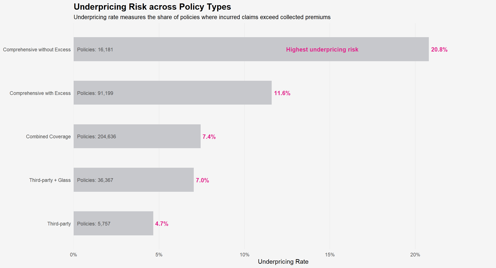
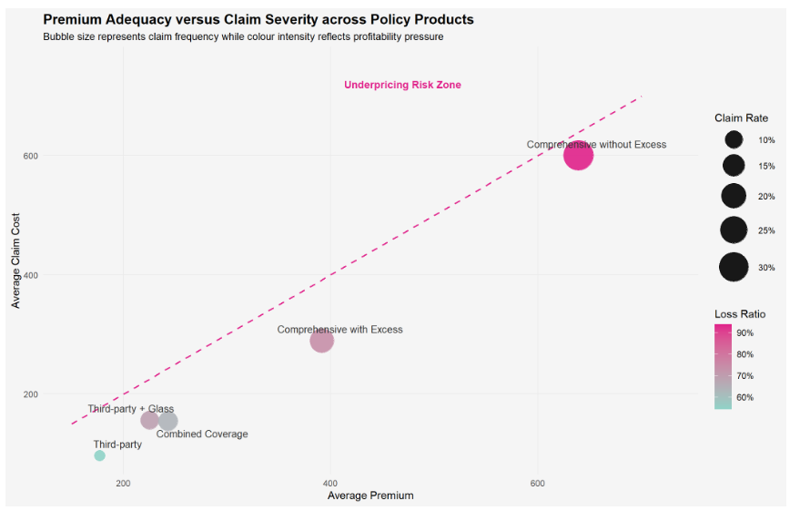
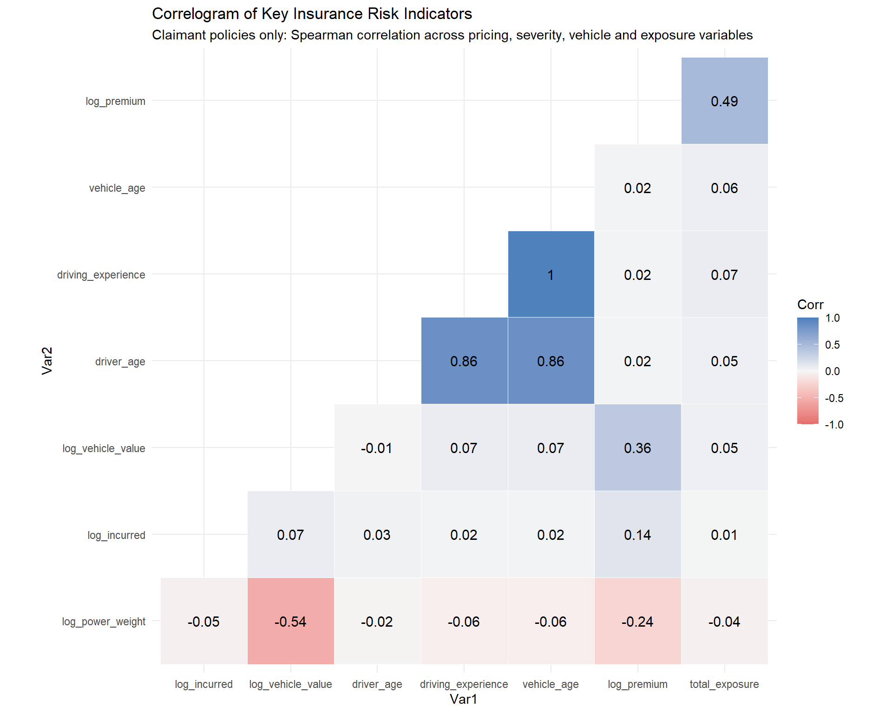
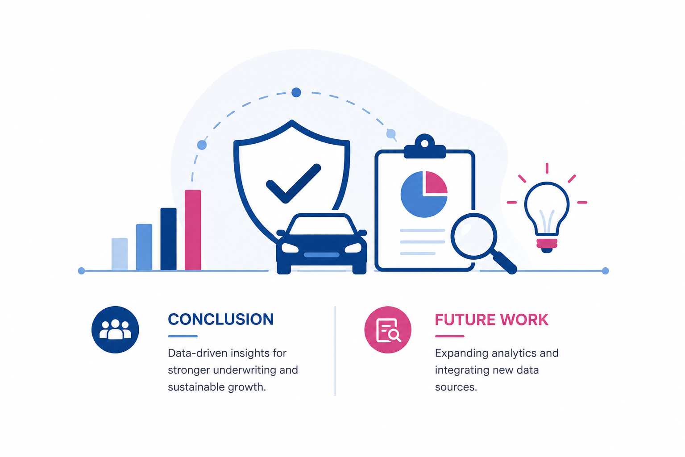

---
format:
  revealjs:
    theme: simple
    slide-number: true
    transition: slide
    smaller: true
    incremental: false
    css: slides.css

execute:
  eval: true
  echo: false
  warning: false
  message: false

freeze: false
---

```{r}
#| include: false

pacman::p_load(tidyverse,ggplot2,scales,patchwork,ggdist,ggridges,ggstatsplot)

```

```{r}
#| include: false

motor_raw <- read_csv(
  "Dataset of motor insurance portfolio.csv"
)
```

::: title-slide-custom
<h2>Motor Insurance Executive Summary</h2>

{width="324"}

<p>Javier Phang</p>

<p>ISSS608 Visual Analytics and Applications</p>

<p>Singapore Management University</p>

<p>16 May 2026</p>
:::

## Contents

1.  Objectives

2.  Portfolio Overview

3.  Portfolio Composition Analysis

4.  Claim Behaviour and Risk Patterns

5.  Profitability and Underwriting Performance

6.  Key Insights

7.  Recommendations and Future Work

::: notes
This presentation summarizes the exploratory visual analytics performed on a motor insurance portfolio dataset using the IDEA framework. The analysis focuses on portfolio composition, claim behaviour, underwriting profitability, and emerging risk patterns that may influence portfolio sustainability and pricing adequacy.
:::

## Objectives {.objective-slide}

:::: columns
::: {.column width="90%"}
-   Evaluate the composition and risk distribution of the motor insurance portfolio

-   Analyse claim behaviour and underwriting profitability patterns

-   Identify high-risk customer and vehicle segments associated with higher claim exposure

-   Support data-driven pricing, underwriting, and portfolio management decisions through visual analytics
:::
::::

::: notes
This study applies the IDEA framework to evaluate the motor insurance portfolio from both risk and profitability perspectives. The analysis focuses on identifying claim behaviour patterns, underwriting profitability dynamics, and high-risk customer and vehicle segments that may contribute to portfolio volatility.

Using exploratory visual analytics techniques, the study examines relationships across policy, customer, vehicle, and claim-related variables to uncover meaningful risk patterns and profitability insights.

Nonetheless, the findings aim to support more informed pricing, underwriting, and portfolio management decisions while demonstrating the value of visual analytics in insurance portfolio analysis.
:::

## Portfolio Overview

### Dataset Summary

-   Years Covered: 2022–2024

-   Total Policy Records: 354,140

-   Policy-level motor insurance portfolio

-   Customer, vehicle, claims, and financial variables analysed

### Key Areas of Analysis

-   Claim behaviour patterns

-   Underwriting profitability

-   High-risk customer segments

-   Vehicle risk exposure

-   Pricing adequacy evaluation

::: notes
This slide provides a high-level overview of the motor insurance portfolio dataset used in the analysis. The dataset contains more than 350,000 policy-level records collected between 2022 and 2024, covering customer, vehicle, claims, and financial-related variables.

The analysis focuses on understanding portfolio composition, claim behaviour, underwriting profitability, and identifying high-risk customer segments. Particular attention is given to pricing adequacy and vehicle-related risk exposure, which are important factors affecting insurance profitability and portfolio sustainability.
:::

## Portfolio Composition Analysis

::::::: smaller-bullets
:::::: columns
::: {.column width="48%"}
{width="100%"}

<h4 style="text-align:center;">

```{=html}
<a href="https://javierphangsy.vercel.app/Take-Home_Ex/Take-Home_Ex01/Take-Home_Ex01.html#claim-status-composition" 
title="View detailed claim status composition analysis in the technical report"
target="_blank">
```

Claim Status Composition

</a>

</h4>

-   Approximately 85.7% of policies remained claim-free, while only 14.3% reported claims

-   Claim activity is concentrated within a relatively small proportion of policyholders, indicating uneven portfolio risk exposure

-   Although claim-reporting policies form a minority segment, they may contribute disproportionately to underwriting volatility and incurred claim costs
:::

::: {.column width="4%"}
 
:::

::: {.column width="48%"}
{width="100%"}

<h4 style="text-align:center;">

```{=html}
<a href="https://javierphangsy.vercel.app/Take-Home_Ex/Take-Home_Ex01/Take-Home_Ex01.html#premium-distribution-across-policies" 
title="View detailed premium distribution analysis in the technical report"
target="_blank">
```

Premium Distribution

</a>

</h4>

-   Premium values exhibit strong right-skewness, reflecting substantial variation in pricing levels across policyholders

-   The median premium is concentrated within lower-to-moderate premium ranges, suggesting a predominantly standard-risk portfolio

-   A smaller group of high-premium policies forms the long right tail and may contribute disproportionately to portfolio revenue and risk exposure
:::
::::::
:::::::

::: notes
This slide provides an overview of the portfolio composition and premium structure within the motor insurance portfolio. Approximately 85.7% of policies remained claim-free, while only 14.3% reported claims. This suggests that underwriting risk exposure is concentrated within a relatively smaller group of policyholders rather than being evenly distributed across the portfolio.

The premium distribution exhibits strong right-skewness, where most policies fall within lower-to-moderate premium ranges, while a smaller group of high-premium policies forms the long right tail of the distribution. The median premium line further indicates that the typical policyholder belongs to a standard-risk segment.

In short, these findings provide important context for understanding portfolio risk concentration, pricing variation, and subsequent analyses on claim behaviour, underwriting profitability, and high-risk customer segments.
:::

## Claim Behaviour Analysis

::::::: smaller-bullets
:::::: columns
::: {.column width="48%"}
{width="100%" height="260px"}

<h4 style="text-align:center;">

```{=html}
<a href="https://javierphangsy.vercel.app/Take-Home_Ex/Take-Home_Ex01/Take-Home_Ex01.html#yearly-portfolio-performance" 
title="View detailed yearly portfolio performance analysis in the technical report"
target="_blank">
```

Yearly Portfolio Performance

</a>

</h4>

-   Claim rate increased from 13.0% in 2022 to 15.1% in 2024, indicating progressively higher claim occurrence across the portfolio

-   Loss ratio rose substantially from 65.6% to 74.7%, reflecting worsening underwriting profitability over time

-   Underpricing exposure also increased from 8.0% to 9.7%, suggesting growing profitability pressure and portfolio instability
:::

::: {.column width="4%"}
 
:::

::: {.column width="48%"}
{width="100%" height="260px"}

<h4 style="text-align:center;">

```{=html}
<a href="https://javierphangsy.vercel.app/Take-Home_Ex/Take-Home_Ex01/Take-Home_Ex01.html#does-claim-severity-distribution-differ-across-vehicle-value-segments" 
title="View detailed claim severity distribution analysis in the technical report"
target="_blank">
```

Claim Severity Distribution

</a>

</h4>

-   Higher vehicle value segments exhibit broader claim severity distributions and stronger tail-risk behaviour

-   Premium vehicle categories demonstrate wider variability and more extreme incurred-loss observations compared to lower-value segments

-   Uneven claim severity distributions suggest differing levels of financial exposure and underwriting volatility across insured vehicle groups
:::
::::::
:::::::

::: notes
This slide examines claim behaviour and underwriting risk patterns within the motor insurance portfolio. The yearly portfolio performance chart indicates that claim rate increased from 13.0% in 2022 to 15.1% in 2024, while the loss ratio rose from 65.6% to 74.7% over the same period. Underpricing exposure also increased from 8.0% to 9.7%, suggesting progressively worsening underwriting profitability and growing portfolio pressure over time.

The claim severity distribution further reveals that higher-value vehicle segments exhibit broader incurred-loss distributions, stronger tail-risk behaviour, and greater variability in claim severity. Premium vehicle categories also demonstrate more extreme loss observations compared to lower-value vehicle groups.

Overall, these findings suggest that portfolio profitability pressure is influenced by both worsening claim trends over time and concentrated high-severity losses among premium vehicle segments.
:::

## Policyholder Risk Profile Analysis

::::::: smaller-bullets
:::::: columns
::: {.column width="48%"}


<h4 style="text-align:center;">

<a href="https://javierphangsy.vercel.app/Take-Home_Ex/Take-Home_Ex01/Take-Home_Ex01.html#driver-age-profile" 
title="View detailed driver age profile analysis in the technical report"
target="_blank">

Driver Age Composition

</a>

</h4>

-   Policyholder exposure is concentrated within middle-aged drivers aged 30–59, which together account for over 70% of the insured portfolio

-   Drivers below age 30 represent only 2.7% of policyholders, indicating limited exposure to traditionally higher-risk young-driver segments

-   The portfolio demonstrates a relatively mature age structure, suggesting stronger concentration among experienced policyholders
:::

::: {.column width="4%"}
 
:::

::: {.column width="48%"}


<h4 style="text-align:center;">

<a href="https://javierphangsy.vercel.app/Take-Home_Ex/Take-Home_Ex01/Take-Home_Ex01.html#driving-experience-profile" 
title="View detailed driving experience profile analysis in the technical report"
target="_blank">

Driving Experience Profile

</a>

</h4>

-   Highly experienced drivers exhibit wider variability in driving tenure, indicating differing long-term driving exposure patterns

-   Less experienced drivers display narrower and more concentrated driving experience distributions

-   Driving experience alone may not fully explain underwriting risk, as claim volatility can still vary across customer and vehicle segments
:::
::::::
:::::::

::: notes
This slide evaluates the demographic and behavioural characteristics of insured policyholders within the motor insurance portfolio. The driver age profile shows that policyholder exposure is heavily concentrated among middle-aged drivers aged 30 to 59, which collectively account for more than 70% of the insured population. In contrast, drivers below age 30 represent only a small proportion of the portfolio, indicating limited exposure to traditionally higher-risk younger driver groups.

The driving experience profile further reveals that highly experienced drivers exhibit wider variability in driving tenure, while newer drivers demonstrate more concentrated experience patterns. These findings suggest that although the portfolio is largely composed of mature and experienced policyholders, underwriting risk should still be evaluated together with claim behaviour, vehicle characteristics, and policy structure rather than relying solely on demographic indicators.
:::

## Insurance Product Risk Analysis

::::::: smaller-bullets
:::::: columns
::: {.column width="48%"}
{width="100%" height="260px"}

<h4 style="text-align:center;">

<a href="https://javierphangsy.vercel.app/Take-Home_Ex/Take-Home_Ex01/Take-Home_Ex01.html#insurance-risk-and-profitability-across-policy-types" 
title="View detailed insurance risk and profitability analysis in the technical report"
target="_blank">

Policy Products with Greater Underpricing Risk

</a>

</h4>

-   Comprehensive without Excess recorded the highest underpricing exposure at 20.8%, substantially exceeding other policy products

-   Comprehensive with Excess also demonstrated elevated underpricing risk at 11.6%, suggesting higher probability of claims exceeding collected premiums

-   Third-party and combined coverage products showed comparatively lower underpricing exposure, indicating relatively stronger pricing adequacy
:::

::: {.column width="4%"}
 
:::

::: {.column width="48%"}
{width="100%" height="260px"}

<h4 style="text-align:center;">

<a href="https://javierphangsy.vercel.app/Take-Home_Ex/Take-Home_Ex01/Take-Home_Ex01.html#insurance-risk-and-profitability-across-policy-types" 
title="View detailed profitability risk positioning analysis in the technical report"
target="_blank">

Profitability Risk Positioning

</a>

</h4>

-   Comprehensive without Excess exhibited the highest claim frequency (31.3%), average claim cost (600), and loss ratio (93.9%), indicating substantial underwriting pressure

-   Higher premium products did not necessarily demonstrate lower portfolio risk, as elevated premiums were accompanied by higher claim severity and profitability pressure

-   Third-party products displayed comparatively lower claim frequency, claim severity, and loss ratios, suggesting more stable underwriting performance
:::
::::::
:::::::

::: notes
This slide evaluates underwriting profitability and pricing adequacy across different insurance product categories. The underpricing analysis shows that Comprehensive without Excess policies recorded the highest underpricing exposure at 20.8%, indicating that claims frequently approached or exceeded collected premiums. Comprehensive with Excess products also demonstrated elevated underpricing risk relative to other policy categories.

The profitability risk positioning chart further reveals that Comprehensive without Excess products experienced the highest claim frequency, average claim severity, and loss ratio, indicating substantial underwriting pressure despite higher premium levels. In contrast, Third-party products displayed relatively lower claim frequency and profitability volatility. Together, these findings suggest that product structure, pricing adequacy, and claim severity jointly influence underwriting sustainability and portfolio profitability.
:::

## High-Risk Segment Analysis

::::::: smaller-bullets
:::::: columns
::: {.column width="48%"}
{width="100%" height="250px"}

<h4 style="text-align:center;">

```{=html}
<a href="https://javierphangsy.vercel.app/Take-Home_Ex/Take-Home_Ex01/Take-Home_Ex01.html#does-driver-age-influence-claim-risk-differently-across-policy-types" 
title="View detailed technical analysis section in the technical report"
target="_blank">
```

Driver Age and Policy Risk Relationship

</a>

</h4>

-   Comprehensive without Excess recorded the highest claim rates across all driver age groups, remaining consistently above 30%

-   Drivers aged 18–24 exhibited elevated claim exposure across multiple policy products, including a 21.1% claim rate under Combined Coverage policies

-   Third-party products maintained comparatively lower claim rates across age groups, generally remaining below 13%
:::

::: {.column width="4%"}
 
:::

::: {.column width="48%"}
{width="100%" height="250px"}

<h4 style="text-align:center;">

```{=html}
<a href="https://javierphangsy.vercel.app/Take-Home_Ex/Take-Home_Ex01/Take-Home_Ex01.html#which-policy-products-exhibit-greater-tail-risk-exposure" 
title="View detailed tail-risk exposure analysis in the technical report"
target="_blank">
```

Policy Product Tail-Risk Exposure

</a>

</h4>

-   Comprehensive products display broader claim severity distributions and stronger right-tail behaviour relative to other policy types

-   Third-party policies exhibit narrower severity concentration, suggesting lower underwriting volatility and more stable claim behaviour

-   The wider dispersion observed among comprehensive products indicates greater exposure to extreme incurred-loss events and profitability pressure
:::
::::::
:::::::

::: notes
This slide evaluates higher-risk portfolio segments from both demographic and insurance product perspectives. The driver age relationship analysis shows that Comprehensive without Excess products consistently recorded the highest claim rates across all driver age groups, remaining above 30% throughout the portfolio. Younger drivers aged 18 to 24 also demonstrated elevated claim exposure across several policy products, including a 21.1% claim rate under Combined Coverage policies. In contrast, Third-party policies maintained relatively lower claim rates across age groups.

The policy product tail-risk analysis further reveals that comprehensive insurance products exhibit broader claim severity distributions and stronger right-tail behaviour relative to other policy categories. The wider severity dispersion indicates greater exposure to extreme incurred-loss events and increased underwriting volatility. Together, these findings reinforce the importance of combining demographic segmentation and product-level risk analysis when evaluating portfolio sustainability and pricing adequacy.
:::

## Profitability and Risk Analysis

::: {style="text-align:center;"}
{width="38%"}
:::

::::::: smaller-bullets
:::::: columns
::: {.column width="48%"}
<h4 style="text-align:center; margin-top:10px;">

<a href="https://javierphangsy.vercel.app/Take-Home_Ex/Take-Home_Ex01/Take-Home_Ex01.html#which-portfolio-variables-are-most-strongly-associated-with-profitability-and-claim-behaviour" 
title="View detailed profitability and claim behaviour relationship analysis in the technical report"
target="_blank">

Relationship among Key Risk Indicators

</a>

</h4>

-   Strong positive relationships are observed between incurred claims, claim severity, loss ratio, and underpricing exposure

-   Premium levels demonstrate moderate association with claim severity, indicating that higher-priced products may also experience higher financial exposure

-   The correlogram suggests that underwriting profitability is influenced by multiple interrelated portfolio risk indicators rather than isolated variables
:::

::: {.column width="4%"}
 
:::

::: {.column width="48%"}
<h4 style="text-align:center; margin-top:10px;">

Key Profitability Insights

</h4>

-   Portfolio profitability deteriorates when higher claim frequency and higher claim severity occur simultaneously

-   Higher premium products do not necessarily correspond to lower underwriting risk, as some comprehensive products also exhibit elevated loss ratios and underpricing exposure

-   Customer characteristics, product structure, and claim behaviour collectively contribute to portfolio volatility and profitability pressure
:::
::::::
:::::::

::: notes
This slide examines the relationships among key portfolio profitability and underwriting risk indicators. The correlogram highlights strong positive associations between incurred claims, claim severity, loss ratio, and underpricing exposure, indicating that profitability pressure is driven by several interconnected risk dimensions rather than isolated variables alone. Premium levels also demonstrate moderate association with claim severity, suggesting that higher-priced insurance products may simultaneously experience greater financial exposure.

The overall findings indicate that underwriting profitability deteriorates when elevated claim frequency and high claim severity occur together. The analysis further shows that higher premium products do not necessarily imply lower underwriting risk, as several comprehensive insurance products continue to exhibit substantial loss ratios and pricing pressure. Together, these findings reinforce the importance of integrated underwriting, pricing adequacy monitoring, and risk-based portfolio segmentation to support long-term portfolio sustainability.
:::

## Key Insights

:::::: columns
::: {.column width="34%"}
<br>

{fig-align="center"}
:::

:::: {.column width="66%"}
### Insights {.smaller-heading}

::: smaller-bullets
-   Portfolio risk exposure is concentrated within a relatively small proportion of policyholders despite most policies remaining claim-free

-   Comprehensive insurance products consistently exhibited higher claim frequency, claim severity, loss ratios, and underpricing exposure relative to other policy structures

-   Claim behaviour and underwriting profitability varied substantially across customer demographics, vehicle characteristics, and insurance product categories

-   Higher premium levels alone did not guarantee stronger underwriting performance, as several high-premium products continued to experience elevated claim costs

-   The relationship between pricing adequacy, claim severity, and portfolio segmentation plays a critical role in overall underwriting sustainability
:::
::::
::::::

::: notes
This slide consolidates the major findings derived from the exploratory visual analytics conducted on the motor insurance portfolio dataset. Although most policyholders did not submit claims, underwriting pressure and financial risk exposure were concentrated within a smaller subset of higher-risk policies.

Comprehensive insurance products consistently demonstrated higher claim frequency, greater claim severity, elevated loss ratios, and stronger underpricing exposure relative to other policy categories. The analysis also revealed that profitability patterns varied considerably across customer demographics, vehicle characteristics, and insurance product structures.

Furthermore, higher premium levels alone did not guarantee improved underwriting outcomes, as several high-premium products continued to experience elevated claim costs and financial pressure. Overall, the findings suggest that portfolio sustainability depends on the combined interaction of pricing adequacy, claim behaviour, customer segmentation, and underwriting risk management strategies.
:::

## Conclusion & Future Work

::: {style="text-align:center; margin-top:-18px; margin-bottom:-18px;"}
{width="48%"}
:::

:::::::: conclusion-columns
::::::: columns
:::: {.column width="55%"}
### Conclusion {.smaller-subheading}

::: smaller-bullets
-   Motor insurance profitability is influenced by the combined interaction of claim behaviour, pricing adequacy, policy structure, and vehicle risk exposure

-   Comprehensive insurance products consistently demonstrated higher claim severity, loss ratios, and underpricing pressure across the portfolio

-   Visual analytics revealed meaningful patterns in underwriting profitability, portfolio volatility, and emerging risk concentration segments
:::
::::

:::: {.column width="45%"}
### Future Work {.smaller-subheading}

::: smaller-bullets
-   Extend the analysis using additional behavioural and operational variables such as telematics and fraud indicators

-   Perform confirmatory statistical modelling to validate the exploratory analytical findings

-   Expand longitudinal portfolio analysis to monitor evolving underwriting and profitability trends over time
:::
::::
:::::::
::::::::

::: notes
This slide summarizes the overall conclusions and future analytical opportunities derived from the motor insurance portfolio analysis.

The findings indicate that underwriting profitability is influenced by the combined interaction of claim behaviour, pricing adequacy, customer risk exposure, vehicle characteristics, and policy structure rather than any single isolated factor. Comprehensive insurance products consistently demonstrated higher claim severity, elevated loss ratios, and stronger underpricing exposure across the portfolio.

The study also highlights how exploratory visual analytics can support deeper understanding of underwriting profitability, portfolio volatility, and emerging risk concentration patterns. Future analytical work could incorporate additional behavioural, operational, and telematics-related variables together with confirmatory statistical modelling and longer-term trend analysis to further strengthen portfolio monitoring and risk assessment capabilities.
:::
